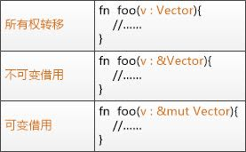

## 入门 Task
* 字符串操作
* stdin/stdout/文件操作
* 数据结构实现

## 进阶 Task
处于自身实力的考虑，我给自己的设计的任务会相对简单一些，更应用层一些
* 反转二叉树
* 基于向量、矩阵的图形变换、图形关系的简单实现，且基于 wasm 在浏览器上实现调用
* 简单 CLI 程序，比如一键配置化启动指定前端项目
* 加上达到龙哥的及格线

## 本周分享
有趣的 Rust
* 不关心函数定义于何处，只要定义了就行
* 可变与不可变
  * 借用限制：当大家都在读一个东西的时候，是不能写的。当一个人在写的时候，别人是不能读的
* statement VS expression
  * 语句：分号结尾，无返回值（只是一句话）
  * 表达式：无结尾，返回一个值（表达一个结果）
* 函数返回值
  * 如果函数有返回值，则要在箭头（->）后声明它的类型。
  * 函数的返回值等同于函数体最后一个表达式的值
* 关联函数
* 变量重写
* 悬垂引用
* 有趣的字符串字面值

可变与不可变总结

