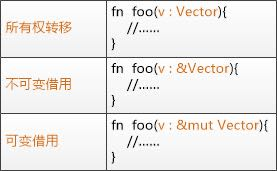

## 本周学习内容
关于函数定义
* 不关心函数定义于何处，只要定义了就行
* 如果函数有返回值，则要在箭头（->）后声明它的类型。
* 函数的返回值等同于函数体最后一个表达式的值

变量与数据
* 可变与不可变：当大家都在读一个东西的时候，是不能写的。当一个人在写的时候，别人是不能读的
* 变量重写

可变与不可变结合函数使用的总结

结构体了解
* 关联函数

statement vs expression
* 语句：分号结尾，无返回值（只是一句话）
* 表达式：无结尾，返回一个值（表达一个结果）

其他
* 悬垂引用
* 有趣的字符串字面值

## 具体内容
命名分隔
* 源文件总是以 .rs 扩展名结尾。如果文件名包含多个单词，使用下划线分隔它们。例如命名为 hello_world.rs，而不是 helloworld.rs。
* 代码中的函数和变量名使用 snake case 规范风格。在 snake case 中，所有字母都是小写并使用下划线分隔单词。
* 自动格式化工具：rustfmt（Rust 团队计划最终将该工具包含在标准 Rust 发行版中）

宏和普通函数的区别

先编译再运行
* 编译 rustc main.rs
* 运行 .main

Rust 是一种预编译静态类型（ahead-of-time compiled）语言，这意味着你可以编译程序，并将可执行文件送给其他人，他们甚至不需要安装 Rust 就可以运行。

Cargo 是 Rust 的构建系统和包管理器
* cargo new
* cargo build
* cargo run 编译并运行
* cargo check 快速检查代码确保其可以编译，但并不产生可执行文件
* cargo build --release 优化编译项目
* cargo update：忽略 Cargo.lock 文件，并计算出所有符合 Cargo.toml 声明的最新版本。如果成功了，Cargo 会把这些版本写入 Cargo.lock 文件
* cargo doc --open 命令来构建所有本地依赖提供的文档，并在浏览器中打开

区分 statement 和 expression
* 语句：执行一些操作但不返回值的指令
* 表达式：计算并产生一个值
* 表达式可以是语句的一部分
  * 数字本身就是一个表达式：6 是一个表达式，它计算出的值是 6
  * 函数调用是一个表达式
  * 宏调用是一个表达式
  * 创建新作用域的大括号（代码块）{} 也是一个表达式
  * 注意：表达式的结尾没有分号。如果在表达式的结尾加上分号，它就变成了语句，而语句不会返回值。

关于函数
* 不关心函数定义于何处，只要定义了就行
* 如果函数有返回值，则要在箭头（->）后声明它的类型。
* 函数的返回值等同于函数体最后一个表达式的值
* 使用 return 关键字和指定值，可从函数中提前返回

控制流
* 使用过多的 else if 表达式会使代码显得杂乱无章，所以如果有多于一个 else if 表达式，最好重构代码。比如使用 match
* 因为 if 是一个表达式，我们可以在 let 语句的右侧使用它
* Rust 有三种循环：loop、while 和 for-in
* 循环返回：如果将返回值加入你用来停止循环的 break 表达式，它会被停止的循环返回
* Range
  * 用来生成从一个数字开始到另一个数字之前结束的所有数字的序列 `(1..4)`
  * rev() 反转 Range

标准库
* use 关键字引入
* std：比如 std::io

String
* 标准库提供的字符串类型，它是 UTF-8 编码的可增长文本块
* `::` 语法表明 new 是 String 类型的一个关联函数，可用其他语法的静态函数理解（很多类型上有 new 函数，因为它是创建类型实例的惯用函数名）

> & 表示这个参数是一个引用（reference），它允许多处代码访问同一处数据，而无需在内存中多次拷贝。

Rust 标准库中有很多叫做 Result 的类型：一个通用的 Result 以及在子模块中的特化版本，比如 io::Result。
* Result 类型是枚举（enumerations）
* Result 的成员是 Ok 和 Err，Ok 成员表示操作成功，内部包含成功时产生的值。Err 成员则意味着操作失败，并且包含失败的前因后果。
* Result 类型的作用是编码错误处理信息。有点类似其他语法的 try-catch 机制
* expect 方法：如果 Result 的结果是 Err，expect 会导致程序奔溃，并显示传递给 expect 信息，实例的值是 Ok，expect 会获取 Ok 中的值并原样返回。

Rust 标准库中尚未包含随机数功能。Rust 团队还是提供了一个 rand crate。

Crates.io 是 Rust 生态环境中的开发者们向他人贡献 Rust 开源项目的地方。

match 表达式：一个 match 表达式由分支（arms）构成。一个分支包含一个模式（pattern）和表达式开头的值与分支模式相匹配时应该执行的代码。

Rust 允许你通过定义新的相同变量名来隐藏之前的变量名，常用来需要转换值类型之类的场景，允许我们复用变量的名字，而不是被迫创建两个变量

字符串的 parse 方法用于将字符串解析成数字，parse 方法返回一个 Result 类型。

将 expect 调用换成 match 语句，是从遇到错误就崩溃转换到真正处理错误的惯用方法。须知 parse 返回一个 Result 类型，而 Result 是一个拥有 Ok 或 Err 成员的枚举。

所有权：Rust 通过所有权系统管理内存，编译器在编译时会根据一系列的规则进行检查。在运行时，所有权系统的任何功能都不会减慢程序。

栈与堆
* 栈和堆都是代码在运行时可供使用的内存
* 栈以放入值的顺序存储值并以相反顺序取出值后进先出（后进先出）
* 栈中的所有数据都必须占用已知且固定的大小。在编译时大小未知或大小可能变化的数据，要改为存储在堆上
* 当向堆放入数据时，你要请求一定大小的空间。操作系统在堆的某处找到一块足够大的空位，把它标记为已使用，并返回一个表示该位置地址的指针。因为指针的大小是已知并且固定的，你可以将指针存储在栈上
* 入栈比在堆上分配内存要快，因为入栈时操作系统无需为存储新数据去搜索内存空间；其位置总是在栈顶。相比之下，在堆上分配内存则需要更多的工作，这是因为操作系统必须首先找到一块足够存放数据的内存空间，并接着做一些记录为下一次分配做准备
* 访问堆上的数据比访问栈上的数据慢，因为必须通过指针来访问。现代处理器在内存中跳转越少就越快，处理器在处理的数据彼此较近的时候（比如在栈上）比较远的时候（比如可能在堆上）能更好的工作。

跟踪哪部分代码正在使用堆上的哪些数据，最大限度的减少堆上的重复数据的数量，以及清理堆上不再使用的数据确保不会耗尽空间，这些问题正是所有权系统要处理的。

所有权规则
* 每一个值都有一个被称为其所有者（owner）的变量
* 值有且只有一个所有者
* 当所有者（变量）离开作用域，这个值将被丢弃

> str 表示定长字符串，也叫做字符串字面值，它是不可变的，因此存储在栈上。由于并不是所有字符串的值都能在编写代码时就知道，因此 Rust 有第二个字符串类型String，表示字符串对象，存储在堆上，所以能够存储在编译时未知大小的文本。

为什么 String 可变而字面值却不行呢？区别在于两个类型对内存的处理上。
* 字符串字面值：在编译时就知道其内容，所以文本被直接硬编码进最终的可执行文件中。这使得字符串字面值快速且高效。不过这些特性都只得益于字符串字面值的不可变性。
* String 类型：为了支持一个可变，可增长的文本片段，需要在堆上分配一块在编译时未知大小的内存来存放内容。
  * 必须在运行时向操作系统请求内存。
  * 需要一个当我们处理完 String 时将内存返回给操作系统的方法。
* Rust 策略：内存在拥有它的变量离开作用域后就被自动释放

> 在 C++ 中，这种 item 在生命周期结束时释放资源的模式有时被称作 资源获取即初始化（Resource Acquisition Is Initialization (RAII)）

变量与数据的交互方式
* 移动 move
  * 原始类型的变量赋值，本质是值在栈区的拷贝，因此不涉及所有权移动的问题。因此像整型这样的在编译时已知大小的类型被整个存储在栈上，所以拷贝其实际的值是快速的
  * 对于复杂类型而言，就会涉及到堆区资源的所有权转移问题
  * 通常其他高级语言对于变量的赋值会导致多个指针指向堆区同一个资源，但 Rust 不会，因为当变量离开作用域后，Rust 自动调用 drop 函数并清理变量的堆内存。如果有多个资源指向同一个资源，就会导致内存多次释放问题，这会导致严重的内存安全问题。这种场景下，为了确保内存安全，Rust 认为之前的变量不在生效，因此不需要在离开作用域后清理任何东西
* 克隆 clone
  * 如何我们确实需要深度复制堆区的数据，可以使用一个叫做 clone 的通用函数
* 只在栈上的数据：拷贝
* 所有权与函数：将值传递给函数在语义上与给变量赋值相似。向函数传递值可能会移动或者复制，就像赋值语句一样
* 返回值与作用域：返回值也可以转移所有
* 引用 references
  * `&` 符号就是引用，它们允许你使用值但不获取其所有权。比如 `&s1` 语法让我们创建一个指向值 `s1` 的引用，但是并不拥有它。
  * 与使用 `&` 引用相反的操作是解引用（dereferencing），它使用解引用运算符 `*`
  * 将获取引用作为函数参数称为借用（borrowing）
  * 可变引用
    * 可变变量使用 mut 关键字
    * 可变引用使用 &mut
    * 限制：在特定作用域中的特定数据有且只有一个可变引用。好处是 Rust 可以在编译时就避免数据竞争。数据竞争会导致未定义行为，难以在运行时追踪，并且难以诊断和修复；Rust 避免了这种情况的发生，因为它甚至不会编译存在数据竞争的代码！
  * 注意一个引用的作用域从声明的地方开始一直持续到最后一次使用为止。**特别注意**
  * 悬垂引用（Dangling References）：其指向的内存可能已经被分配给其它持有者。在 Rust 中编译器确保引用永远也不会变成悬垂状态：当你拥有一些数据的引用，编译器确保数据不会在其引用之前离开作用域。
  * 引用的规则
    * 在任意给定时间，要么只能有一个可变引用，要么 只能有多个不可变引用。
    * 引用必须总是有效的。
* Slice 类型：slice 允许你引用集合中一段连续的元素序列，而不用引用整个集合。
  * 由中括号中的 [starting_index..ending_index] 指定的 range 创建一个 slice
  * 如果想要从第一个索引（0）开始，可以不写两个点号之前的值
  * 如果想要到最后一个字节，也可以舍弃尾部的数字
  * 字符串字面值就是 slice
  * 场景：字符串、数组

> 变量的所有权总是遵循相同的模式：将值赋给另一个变量时移动它。当持有堆中数据值的变量离开作用域时，其值将通过 drop 被清理掉，除非数据被移动为另一个变量所有。

数据竞争（data race）类似于竞态条件，它可由这三个行为造成：
* 两个或更多指针同时访问同一数据。
* 至少有一个指针被用来写入数据。
* 没有同步数据访问的机制。

扩展 - 迭代器
* iter() 返回集合中的每个元素
* enumerate 包装了 iter 的结果，将这些元素作为元组的一部分来返回。enumerate 返回的元组中，第一个元素是索引，第二个元素是集合中元素的引用。
