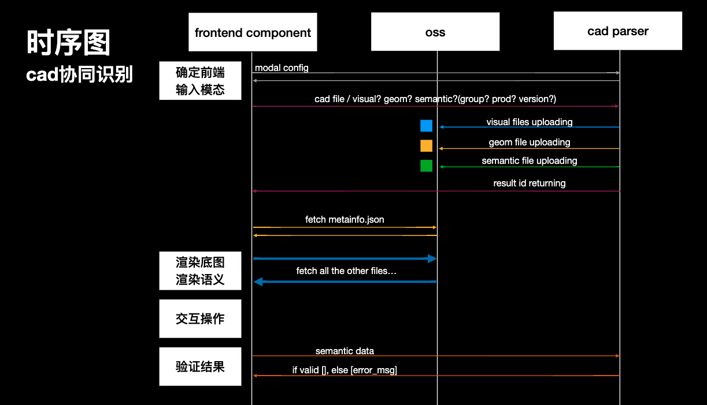
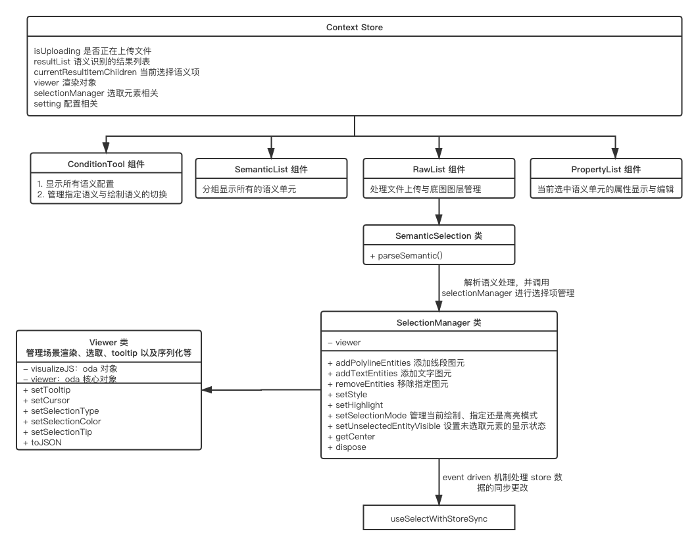

CadRecognizer 组件

## ODA
ODA 全称为 OpenDesign alliance，为我司购买的用于读取 CAD 文件（主要是突破 dwg 格式限制）数据的套件。

对于前端而言比较常用的文档地址如下
* [Forum:Web](https://forum.opendesign.com/forumdisplay.php?45-Web)：官网论坛，实在搞不懂地方，可以在这里讨论
* [cloud doc](https://cloud.opendesign.com/docs/index.html#/overview)：web 端官网文档
* [cloud examples](https://cloud.opendesign.com/docs//examples.html)：简单的例子，能让你有个初步的了解
* [git websdk](https://gitlab.opendesign.com/oda/websdk)：源码 Git 仓库

learn git from oda
* 通过 .gitattributes 添加换行符指定，解决不同平台换行不通导致 diff 问题
* 基于一根（有且只有一根）长期的 develop 开发，每次发版时，基于 develop 创建 release/version 的分支
* 使用 submodules 的方式管理子模块，通过 branch 字段来指定具体的版本，从而解决版本问题

core repo
* Visualize
* Client
  * jsdoc 自动生成文档
* Web
* Web Viewer
* Server
* VisualizeJS
  * rollup
  * eslint

## ODA 升级
这个对于后端而言是一个比较辛苦的事情，但对于前端而言就十分简单了，只需要找到对应版本的 Visualize.js、Visualize.js.wasm 和 OdaViewerPlugin.js 上传到指定的 OSS 地址即可。具体配置见 CadRecognizer/config.ts。

具体资源可以从这里获得：[Release](https://www.opendesign.com/odoutgoing/Releases)

## VisualizeJS
ODA 提供的用于浏览端可视化的库。

VisualizeJS
* 渲染 Open Cloud 解析后的图形
* getVisualizeLibInst 获取实例
  * urlMemFile：Visualize.js.wasm 文件
  * TOTAL_MEMORY：所需的浏览器内存量
* visualizeLibInstance
  * postRun：准备就绪回调
  * canvas：执行用于绘制的 canvas 对象
  * getOverlayController
  * getViewer
* Viewer：单实例类
  * resize
  * update
  * addEmbeddedFile
  * appendFileWrapper
  * createBlock、createLayer、createLocalDatabase、createModel、createRasterImage、createTextStyle、createVisualStyle
  * findXXX
* 插件机制
  * OdaViewerPlugin：集成平移、缩放、镜头控制等
  * OdaSlicePlanePlugin：切面
  * OdaMeasuringPlugin：测量工具
  * OdaWorkerTransportPlugin

常用类：
* Entity：表示图形单元，通过 layer 属性关联具体的 layer
* Block：多个 Entity 组成一个 Model，有点 Template 的味道
* Layer：主要用于管理该图层下的 Entity
* Model：有点分类管理 Entity 的味道
* Device：可以用于创建 view 对象，添加多个 view 实例
* View：拆分视窗

如何读取文件并显示
1. 上传文件到服务端得到一个 fileId
2. 使用 fileId 创建一个从文件中解析图形的任务，得到 jobId
3. 根据 jobId 轮训任务状态，直到任务完成
4. 使用 viewer api 直接渲染图形数据

一下几个图形的区别
* Shell：外壳，第一个参数表示所有的顶点坐标，第二份参数比较复杂，第一个表示面的顶点数量，后面接的参数是各个顶点的下标
* ColoredShape：彩色平面，会填充颜色，参数格式和上面一样
* Mesh：网格化，指定行列数，顶点数和顶点坐标
* Grid：网格线，从原点出发，指向给定的两个点坐标作为向量，再通过两个数指定两个向量沿方向重复多少次来绘制一张网格

使用示例
```js
entityPtr.appendShell([-2, 0, 0, 2, 0, 0, 2, 2, 0, -2, 2, 0], [3, 0, 1, 2, 3, 2, 3, 0])

entityPtr.appendColoredShape([-2, 0, 0, 2, 0, 0, 2, 2, 0, -2, 2, 0], [3, 0, 1, 2, 3, 2, 3, 0])

entityPtr.appendMesh(3, 3, 9, [-2, 2, 0, 0, 2, 0, 2, 2, 0, -2, 0, 0, 0, 0, 0, 2, 0, 0, -2, -2, 0, 0, -2, 0, 2, -2, 0])

entityPtr.appendGrid([0, 0, 0], [-2, 2, 0], [2, 2, 0], 4, 3, 1)
```

已知问题（开始时间：2021年1月19号）
1. polygon 没有 getPoints 方法：fixed
2. setColor 对于 block 不生效：不算是 ODA 的 bug，在 Cad 中，颜色比较复杂
3. getSnapPoint 对于 block 不生效

### 颜色问题
我有个需求需要将原始的 Cad 文件渲染为底图，统一将颜色修改为灰色。一开始简单的通过遍历所有 Layer 的方式，通过修改 Layer 的颜色来达到目的，但总是会有一部分颜色修改不成功。

后面实际把玩了一下 AutoCad 后，发现颜色比想象的要复杂一下，Cad 颜色的设置有如下三种方式
* byLayer
* byBlock
* bySelf

我通过修改 Layer 颜色的方式，只能影响到 byLayer 的对象颜色，对于 byBlock 和 bySelf 的，就改变不了。

## 背景介绍
之前的智能 Cad 识别存在很多限制，比如
* 只能上传 dxf 格式，但市面主流格式是 dwg 格式
* 由于用户上传图纸的不规范，纯粹的智能语义识别无法满足很多特殊情况，导致识别结果并不如人意，且用户不知道错在哪里，从而导致体验不佳

## 功能介绍
为了解决智能 Cad 识别的困境，于是就有了 CadRecognizer 组件，提供如下功能
* 支持用户上传 dwg、dxf 等 Cad 文件，渲染内容作为底图
* 可选的智能语义接入，在智能语义的结果上支持用户进行修正，以及根据底图进行捕捉绘制新的语义
* 与具体业务解耦，通过配置的方式指定需要识别的语义，以及对应的语义参数录入
* 支持对于最终语义数据进行合法性校验，给予不同程度的提示，比如警告和错误

## 实现描述
与后端交互的时序图如下



前端组件交互关键部分如下



## 对接单体组新需求
本地对接单体组需求的迭代计划
* 通用参数录入功能
  * 后端 config 接口增加类似 globalProperties 即可，配置格式等同于语义识别元素属性配置
  * 前端 ConditionTool 组件增加对于该参数的判断，如果存在则使用 tab 组件进行展示
* 增加根据图层方式进行批量指定功能
  * 后端新增对于每个语义数据所属的 layerName 字段
  * 组件增加 enableTools 参数，类型为数组，可选值有：'pick' | 'draw' | 'pick-layer'，默认值 ['pick' | 'draw']
* 增加 ODA 视图功能
* 增加暗黑主题（optional）

至于回到单体应用的底图绘制以及捕捉：单体应用使用 Cad 解析出得到 raw geometry 数据使用 fabric 自行绘制。