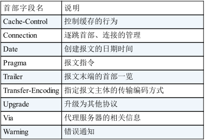
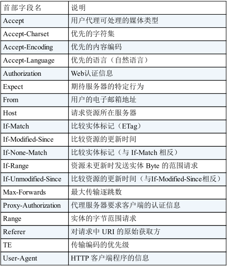
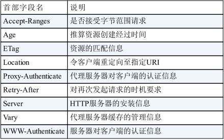
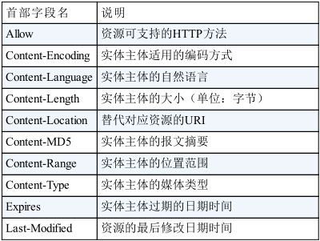
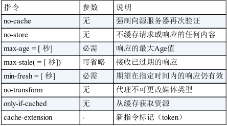
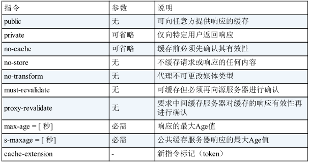

图解HTTP

读《HTTP图解》笔记。

# Web及网络基础
Web使用HTTP(HyperText Transfer Protocol，超文本传输协议)协议作为规范，Web是建立在HTTP协议上通信的。

## HTTP诞生
* 为知识共享而规划Web，借助多文档之间相互关联形成的超文本，连成可相互参阅的WWW(World Wide Web万维网)
  + 页面文本标记语言HTML
  + 文档传递协议HTTP
  * 指定文档所在地址的URL
* Web成长时代
  + Web服务器：CGI、Apache
  + HTML：in-line
  + 浏览器：Netscape、IE、Firefox、Chrome、Opera、Safari
  + 浏览器竞争，不遵循Web标准化导致棘手的兼容性
* 驻足不前的HTTP
  + 1990：HTTP/0.9
  + 1996：HTTP/1.0 正式版
  + 1997：HTTP/1.1 目前主流的HTTP协议版本

## 网络基础TCP/IP
通常使用的网络是在TCP/IP协议族的基础上运作的，而HTTP属于它内部的一个子集。

### TCP/IP协议族
计算机和网络设备要相互通信，双方就必须基于相同的方案，不同的硬件、操作系统之间的通信，所有的这一切都需要一种规则，我们把这种规则称为协议。

### TCP/IP分层管理
层次化之后，设计变得相对简单了，协议族按层次分别为
* 应用层
  + 决定了向用户提供应用服务时通信的活动
  + FTP、DNS、HTTP
* 传输层
  + 对上层应用层，提供处于网络连接中的两台计算机之间的数据传输
  + TCP、UDP
* 网络层
  + 处理在网络上流动的数据包，数据包是网络传输的最小数据单元，规定了通过怎样的路径到达对方计算机，并把数据包传送给对方
  + 与对方计算机之间通过多台计算机或网络设备进行传输是，网络层所起的作用就是在众多的选项内选择一条传输路线
  + IP
* 数据链路层
  + 处理连接网络的硬件部分，包括控制操作系统、硬件的设备驱动、网络适配器、光纤等物理可见部分

### TCP/IP通信传输流
利用TCP/IP协议族进行网络通信时，会通过分成顺序与对方进行通信。发送端从应用层往下走，接收端则往应用层往上走。
1. 应用层发送HTTP请求
2. 传输层TCP把应用层接收到的数据进行分割，并在各个报文上打上标记序号及端口号后发给网络层
3. 网络层增加作为通信目的地的MAC地址后转发给链路层
4. 接受端在链路层收到数据，按序往上层发送，一直到应用层，当传输到应用层，才能算真正接受到客户端发送过来的HTTP请求

> 发送端在层与层之间传输数据时，每经过一层时必定会被打上一个该层所属的首部信息，接收端在层与层传输数据时，每经过一层时会把对应的首部消去，这种把数据信息包装起来的做法称为封装。

## IP、TCP、DNS
这三个协议是与HTTP密不可分的。

### 负责传输的IP协议
作用把各种数据包传送给对方，而要保证确实传送到对方地址，则需要满足各类条件，其中两个最重要的条件是IP地址和MAC地址。

IP地址指名了节点分配到的地址，MAC地址是指网卡所属的固定地址。IP地址可以和MAC地址进行配对。IP地址可变换，但MAC地址基本上不会更改。

在网络上，通信的双方在同一局域网内的情况是很少见的，通常需要经过多台计算机和网络设备中转才能连接到对方，而在中转时，会利用下一站设备的MAC地址来搜索下一个中转目标，这时就需要ARP协议了，ARP是一种用以解析地址的协议，根据通信方的IP地址就可以反查出对应的MAC地址。

### 确保可靠的TCP协议
可供可靠的字节流服务。所谓的字节流服务是指，为了方便传输，将大块数据分割成以报文段为单位的数据包进行管理。而可靠的传输服务是指，能够把数据准确可靠的传给对方。

为了准确无误的把数据送达目标处，TCP协议采用了三次握手策略。TCP不会对传送后的情况置之不理，他一定会向对方确认是否成功送达。握手过程中使用了TCP的标志——SYN和ACK。

大致过程：发送端先发送带有SYN标志的数据包给对方。接收端收到后，回传一个带有SYN/ACK标志的数据包以示传达确认信息，最后发送端再回传一个带ACK标志的数据包，表示握手结束。

### 负责域名解析的DNS服务
DNS服务是和HTTP协议一样位于应用层的协议，提供域名到IP地址的解析服务。

DNS提供域名查找IP地址，或逆向IP地址反查域名的服务。

## URL和URL
与URL（统一资源标识符）相比，我们更熟悉URL（统一资源定位符）。

URI全称Uniform Resource Identifier。
* Uniform：规定统一的格式可方便处理多种不同类型的资源，而不用根据上下文环境来识别资源指定的访问方式
* Resource：可标识的任何东西
* Identifier：表示可标识的对象

> URL就是由某个协议方案表示的资源的定位标识符。协议方案是指访问资源所使用的协议类型的名称。

URI是用字符串标识某一互联网资源，而URL表示资源的地点。URL是URI的子集。

URI格式
* 登录信息（可选）
* 服务器地址
* 端口号
* 带层次的文件路径
* 查询字符串
* 片段标识符

# HTTP协议
请求报文由请求方法、请求URI、协议版本、可选的请求首部字段和内容实体构成的。

响应报文基本上由协议版本、状态码、用以解释状态码的原因短语、可选的响应首部字段以及实体主体构成。

HTTP是一种不保存状态，即无状态协议。HTTP协议自身不对请求和响应之间的通信状态进行保存。也就是说HTTP这个级别，协议对于发送过的请求或响应都不做持久化处理。设计成这样是为了更快的处理大量事务，确保协议的可伸缩性，而特意把协议设计的如此简单。

Cookie状态管理：保留无状态协议这个特征的同时又要解决类似的矛盾问题，于是引入Cookie技术。
* 服务端发送响应报文内Set-Cookie的首部字段信息，通知客户端保存Cookie
* 下次往服务器发送请求时，客户端会自动在请求报文中加入Cookie值后发送出去
* 服务器发送客户端发送过来的Cookie后，会检查究竟是哪一个客户端发来的连接请求，然后对比服务器记录，最后得到之前的状态信息

## HTTP方法
* GET：获取资源
  + 请求资源是文本，则保持原样返回
  + 如果是像CGI(通用网关接口)那样的程序，则返回经过执行后的输出结果
* POST：传输实体主体
  + 虽然GET也可以传输实体的主体，但是一般不用GET
  + POST的功能和GET类似，但主要目的不是获取响应的主体内容
* PUT：传输文件
  + 要求在请求报文主体中包含文件内容，然后保存到URI指定的位置
  + 自身不带验证机制，任何人都可以上传文件，存在安全性问题
* HEAD：获得报文首部
  + 不返回主体部分
  + 用于确定URI的有效性及资源更新的日期时间等
* DELETE：删除文件
  + 与PUT相反，按请求URI删除指定的资源
  + 自身同样不带验证机制
* OPTIONS：询问支持的方法
  + 查询针对请求URI指定的资源支持的方法
* TRACE：追踪路径
  + 让Web服务器将之前的请求通信环回给客户端的方法
  + 发送请求时在Max-Forwards首部字段中填入数值，每经过一个服务端就将该数字减1，当数值刚好减到0时，停止继续传输，最后接受到请求的服务端则返回状态码200 OK的响应
  + 用来查询发出去的请求是怎样被加工修改/篡改的
  + 易引发XST(Cross-Site Tracing，跨站追踪)攻击，通常不会用到
* CONNECT：要求用隧道协议连接代理
  + 要求在于代理服务器通信时建立隧道，实现用隧道协议进行TCP通信，主要使用SSL(Secure Sockets Layer安全套接层)和TLS(Transport Layer Security传输层安全)协议把通信内容加密后经网络隧道传输

### 持久连接
在HTTP初始版本中，没进行一次HTTP通信就要断开一次连接。

随着HTTP的普及，文档中包含大量图片的情况就多了起来，在发送请求访问HTML页面资源的同时，也会请求该HTML页面包含的其他资源。因此每次的请求都会造成TCP连接的建立和断开，增加通信量的开销。

为了解决上述问题，HTTP1.1和部分HTTP1.0想出了持久连接的方法，也称为HTTP keep-alive或HTTP connection reuse。持久连接的特点就是：只要任意一端没有明确提出断开连接，则保持TCP连接状态。

在HTTP1.1中，所有连接默认都是持久连接，但在HTTP1.0内并未标准化。

### 管道化
持久连接使得多数请求以管道化方式发送成为可能。以前发送请求后需等待并收到响应，才能发送下一个请求。管道化技术出现后，不用等待响应就可以直接发送下一个请求。

## Cookie状态管理
由于HTTP协议是无状态协议，无法根据之前的状态进行本次的请求处理。保留无状态这个特性同时又要解决类似的矛盾问题，于是引入的Cookie技术，Cookie技术通过在请求和响应报文中写入Cookie信息来控制客户端状态。

Cookie会根据服务端发送的响应报文中Set-Cookie的首部字段信息通知客户端写Cookie，当下次客户端再往服务端发请求时，客户端会自动在请求报文中加入Cookie值后发送出去。

# HTTP信息
HTTP报文本身是由多行（CR+CF作换行符）数据构成的字符串文本。

HTTP报文大致可以分为报文首部和报文主体两块，两者由最初出现的空行（CR+CF）来划分，通常并不一定要有报文主体。

其中头部信息可以进一步细分
* 请求行（状态行）
  * 请求行：请求的方法，URL和HTTP版本
  * 状态行：状态码，原因短语和HTTP版本
* 请求（响应）首部字段
* 通用首部字段
* 实体首部字段
* 其他

## 编码
HTTP在传输时可以按照数据原样直接传输，但也可以在传输中通过编码提升效率。

报文主体和实体主体差异
* 报文：HTTP通信的基本单位，由8位组字节流组成，通过HTTP通信传输
* 实体：作为请求或响应的有效载荷数据被传输，其内容由实体首部和实体主体组成

HTTP报文主体用于传输请求或响应的实体主体

> 通常，报文主体等于实体主体，只有当传输中进行编码时，实体主体的内容发生变化时，才导致它和报文主体产生差异。

常见的内容编码
* gzip（GUN ZIP）
* compress（UNIX 标准压缩）
* deflate（zlib）
* identity（不进行编码）

分块传输：在HTTP通信中，请求的编码实体资源尚未全部传输完成之前，浏览器无法显示请求页面，在传输大容量数据时，通过把数据分隔成多块，能够让浏览器逐步显示页面。这种把主体分块的功能称为分块传输编码。

分块传输编码将实体主体分成多个部分，每块都会用16进制来表示标记块的大小，实体主体最后一块用"0(CR+CF)"来标记。

### 多部分对象集合
HTTP协议采用了多部分对象集合，发送一份报文主体内可含有多类型实体。通常在图片或文本上传时使用。

多部分对象集合包含的对象如下：
* multipart/form-data：在web表单文件上传时使用
* multipart/byteranges：状态码206响应报文包含了多个范围的内容时使用

在HTTP报文中使用多部分对象集合时，需要在首部字段加上`content-type`。使用boundary字符串来划分多部分对象集合指明的各类实体。

### 获取部分内容
背景：如果下载过程中遇到网络中断的情况，就必须重头开始，为了解决这个问题，需要一种可恢复的机制，所谓恢复是指能从之前中断下载处恢复下载。

要实现该功能，需要知道下载的实体范围，指定范围发送的请求就叫做范围请求。

执行范围请求，会用到首部字段range来指定资源的byte范围
```shell
# 5000·10000字节
range: bytes = 5001-10000
# 5001字节之后全部的
range: bytes = 5001-
# 从一开始到3000，和5000到7000的多重范围
range: bytes = -3000,5000-7000
```

针对范围请求，响应会返回状态码为206 Partial Content的响应报文，宁外对于多重范围的范围请求，响应会在首部字段`content-type`标明为multipart/byteranges后返回响应报文。如果服务端无法响应范围请求，则会返回状态码200 OK和完整的实体内容。

### 内容协商
当浏览器默认语言为英语或中文，访问相同URI的Web页面时，则会显示对应的英文版和中文版的Web页面，这样的机制称为内容协商。

内容协商机制是指客户端和服务端就响应的资源内容进行交涉，然后提供给客户端最为合适的资源。内容协商会以响应资源的语言、字符集、编码方式等作为判断的依据。

包含在请求报文中的某些首部信息就是判断的依据
* accept
* accept-charset
* accept-encoding
* accept-language
* content-language

内容协商技术有一下三种类型
* 服务端驱动协商
* 客户端驱动协商
* 透明协商

# HTTP状态码
响应的状态码可描述请求的处理结果，数字中的第一位指定了响应类别，后两位无分类。响应类别有以下 5 种。
* 1XX Informational（信息性状态码） 接收的请求正在处理
* 2XX Success（成功状态码） 请求正常处理完毕
* 3XX Redirection（重定向状态码） 需要进行附加操作以完成请求
* 4XX Client Error（客户端错误状态码） 服务器无法处理请求
* 5XX Server Error（服务器错误状态码） 服务器处理请求出错

只要遵守状态码类别的定义，即使改变 RFC2616 中定义的状态码，或服务器端自行创建状态码都没问题。

我们就介绍一下这些具有代表性的 14 个状态码。
* 2XX 成功：表明请求被正常处理了
  * 200 OK
  * 204 No Content：服务器接收的请求已成功处理，但在返回的响应报文中不含实体的主体部分
  * 206 Partial Content：表示客户端进行了范围请求
* 3XX 重定向：表明浏览器需要执行某些特殊的处理以正确处理请求。
  * 301 Moved Permanently：永久性重定向。该状态码表示请求的资源已被分配了新的 URI，以后应使用资源现在所指的 URI。
  * 302 Found：临时性重定向。该状态码表示请求的资源已被分配了新的 URI，希望用户（本次）能使用新的 URI 访问。
  * 303 See Other：表示由于请求对应的资源存在着另一个 URI，应使用 GET方法定向获取请求的资源。303 状态码和 302 Found 状态码有着相同的功能，但 303 状态码明确表示客户端应当采用 GET 方法获取资源，这点与 302 状态码有区别
  * 304 Not Modified：表示客户端发送附带条件的请求时，服务器端允许请求访问资源，但未满足条件的情况。304 状态码返回时，不包含任何响应的主体部分。
  * 307 Temporary Redirect：临时重定向。该状态码与 302 Found 有着相同的含义。307 会遵照浏览器标准，不会从 POST 变成 GET。但是，对于处理响应时的行为，每种浏览器有可能出现不同的情况。
* 4XX 客户端错误：表明客户端是发生错误的原因所在。
  * 400 Bad Request：该状态码表示请求报文中存在语法错误。当错误发生时，需修改请求的内容后再次发送请求。另外，浏览器会像 200 OK 一样对待该状态码。
  * 401 Unauthorized：表示发送的请求需要有通过 HTTP 认证（BASIC 认证、DIGEST 认证）的认证信息。返回含有 401 的响应必须包含一个适用于被请求资源的 WWW-Authenticate 首部用以质询（challenge）用户信息。当浏览器初次接收到 401 响应，会弹出认证用的对话窗口。
  * 403 Forbidden：表明对请求资源的访问被服务器拒绝了。未获得文件系统的访问授权，访问权限出现某些问题（从未授权的发送源 IP 地址试图访问）等列举的情况都可能是发生 403 的原因。
  * 404 Not Found：该状态码表明服务器上无法找到请求的资源。除此之外，也可以在服务器端拒绝请求且不想说明理由时使用。
* 5XX 服务器错误：表明服务器本身发生错误
  * 500 Internal Server Error：在执行请求时发生了错误。也有可能是 Web 应用存在的 bug 或某些临时的故障。
  * 503 Service Unavailable：表明服务器暂时处于超负载或正在进行停机维护，现在无法处理请求。如果事先得知解除以上状况需要的时间，最好写入 RetryAfter 首部字段再返回给客户端。

> 当 301、302、303 响应状态码返回时，几乎所有的浏览器都会把POST 改成 GET，并删除请求报文内的主体，之后请求会自动再次发送。

> 301、302 标准是禁止将 POST 方法改变成 GET 方法的，但实际使用时大家都会这么做。

> 附带条件的请求是指采用 GET 方法的请求报文中包含 If-Match，If-Modified-Since，If-None-Match，If-Range，If-Unmodified-Since 中任一首部。

# Web服务器

## 多个域名
HTTP/1.1 规范允许一台 HTTP 服务器搭建多个 Web 站点。

在相同的 IP 地址下，由于虚拟主机可以寄存多个不同主机名和域名的 Web 网站，因此在发送 HTTP 请求时，必须在 Host 首部内完整指定主机名或域名的 URI。

## 代理、网关、隧道
HTTP 通信时，除客户端和服务器以外，还有一些用于通信数据转发的应用程序
* 代理是一种有转发功能的应用程序，接收由客户端发送的请求并转发给服务器，同时也接收服务器返回的响应并转发给客户端。
* 网关是转发其他服务器通信数据的服务器，接收从客户端发送来的请求时，它就像自己拥有资源的源服务器一样对请求进行处理。
* 隧道是在相隔甚远的客户端和服务器两者之间进行中转，并保持双方通信连接的应用程序。

### 代理
代理服务器的基本行为就是接收客户端发送的请求后转发给其他服务器。代理不改变请求 URI，会直接发送给前方持有资源的目标服务器。

> 每次通过代理服务器转发请求或响应时，会追加写入 Via 首部信息

在 HTTP 通信过程中，可级联多台代理服务器。请求和响应的转发会经过数台类似锁链一样连接起来的代理服务器。转发时，需要附加 Via 首部字段以标记出经过的主机信息。

使用代理服务器的理由有
* 利用缓存技术减少网络带宽的流量
* 组织内部针对特定网站的访问控制
* 获取访问日志为主要目的
* ……等等。

代理有多种使用方法，按两种基准分类。
* 一种是是否使用缓存
* 另一种是是否会修改报文。

### 网关
网关与代理的区别就是，客户端通过HTTP协议与网关进行通信，但网关通过非HTTP通信协议与非HTTP服务器进行通信。

> 利用网关可以由 HTTP 请求转化为其他协议通信

网关的工作机制和代理十分相似。而网关能使通信线路上的服务器提供非 HTTP 协议服务。

利用网关能提高通信的安全性，因为可以在客户端与网关之间的通信线路上加密以确保连接的安全。

### 隧道
隧道可按要求建立起一条与其他服务器的通信线路，届时使用 SSL 等加密手段进行通信。隧道的目的是确保客户端能与服务器进行安全的通信。

### 缓存
缓存是指代理服务器或客户端本地磁盘内保存的资源副本。利用缓存可减少对源服务器的访问，因此也就节省了通信流量和通信时间。

缓存的有效期限：即使存在缓存，也会因为客户端的要求、缓存的有效期等因素，向源服务器确认资源的有效性。若判断缓存失效，缓存服务器将会再次从源服务器上获取“新”资源。

客户端的缓存：缓存不仅可以存在于缓存服务器内，还可以存在客户端浏览器中。和缓存服务器相同的一点是，当判定缓存过期后，会向源服务器确认资源的有效性。若判断浏览器缓存失效，浏览器会再次请求新资源。

# HTTP首部
使用首部字段是为了给浏览器和服务器提供报文主体大小、所使用的语言、认证信息等内容。

HTTP 首部字段是由首部字段名和字段值构成的，中间用冒号“:” 分隔。另外，字段值对应单个 HTTP 首部字段可以有多个值，中间使用“,”进行分割。

> 若 HTTP 首部字段重复了会如何
> 当 HTTP 报文首部中出现了两个或两个以上具有相同首部字段名时会怎么样？这种情况在规范内尚未明确，根据浏览器内部处理逻辑的不同，结果可能并不一致。有些浏览器会优先处理第一次出现的首部字段而有些则会优先处理最后出现的首部字段。

4 种 HTTP 首部字段类型
* 通用首部字段（General Header Fields）：请求报文和响应报文两方都会使用的首部。
* 请求首部字段（Request Header Fields）：从客户端向服务器端发送请求报文时使用的首部。补充了请求的附加内容、客户端信息、响应内容相关优先级等信息。
* 响应首部字段（Response Header Fields）：从服务器端向客户端返回响应报文时使用的首部。补充了响应的附加内容，也会要求客户端附加额外的内容信息。
* 实体首部字段（Entity Header Fields）：针对请求报文和响应报文的实体部分使用的首部。补充了资源内容更新时间等与实体有关的信息。

首部字段一览

HTTP/1.1 规范定义了如下 47 种首部字段。

通用首部字段



请求首部字段



响应首部字段



实体首部字段



> 在 HTTP 协议通信交互中使用到的首部字段，不限于 RFC2616 中定义的 47 种首部字段。还有 Cookie、Set-Cookie 和 Content-Disposition等在其他 RFC 中定义的首部字段，它们的使用频率也很高。这些非正式的首部字段统一归纳在 RFC4229 HTTP Header Field Registrations 中。

HTTP 首部字段将定义成缓存代理和非缓存代理的行为，分成 2 种类型。
* 端到端首部（End-to-end Header）：分在此类别中的首部会转发给请求 / 响应对应的最终接收目标，且必须保存在由缓存生成的响应中，另外规定它必须被转发。
* 逐跳首部（Hop-by-hop Header）：分在此类别中的首部只对单次转发有效，会因通过缓存或代理而不再转发。HTTP/1.1 和之后版本中，如果要使用 hop-by-hop 首部，需提供 Connection 首部字段。

下面列举了 HTTP/1.1 中的逐跳首部字段。除这 8 个首部字段之外，其他所有字段都属于端到端首部。
* Connection
* Keep-Alive
* Proxy-Authenticate
* Proxy-Authorization
* Trailer
* TE
* Transfer-Encoding
* Upgrade

## 通用首部字段
请求报文和响应报文双方都会使用的首部。

### Cache-Control
用来操作缓存的工作机制。可用于请求及响应，下面是对应指令一览

缓存请求指令


缓存响应指令


详解
* public 指令：当指定使用 public 指令时，则明确表明其他用户也可利用缓存
* private 指令：缓存服务器会对该特定用户提供资源缓存的服务，对于其他用户发送过来的请求，代理服务器则不会返回缓存。
* no-cache 指令
  * 使用 no-cache 指令的目的是为了防止从缓存中返回过期的资源
  * 请求中如果包含 no-cache 指令，则表示客户端将不会接收缓存过的响应。于是，“中间”的缓存服务器必须把客户端请求转发给源服务器。
  * 响应中包含 no-cache 指令，那么缓存服务器不能对资源进行缓存。源服务器以后也将不再对缓存服务器请求中提出的资源有效性进行确认，且禁止其对响应资源进行缓存操作。
  * Cache-Control: no-cache=Location，响应专有，客户端在接收到这个被指定参数值的首部字段对应的响应报文后，就不能使用缓存。
* no-store
  * 暗示请求（和对应的响应）或响应中包含机密信息。
  * no-cache 代表不缓存过期的资源，缓存会向源服务器进行有效期确认后处理资源，no-store 才是真正地不进行缓存
  * 规定缓存不能在本地存储请求或响应的任一部分。
* s-maxage
  * s-maxage 指令的功能和 max-age 指令的相同，它们的不同点是 s-maxage 指令只适用于供多位用户使用的公共缓存服务器
  * 对于向同一用户重复返回响应的服务器来说，这个指令没有任何作用。
  * 当使用 s-maxage 指令后，则直接忽略对 Expires 首部字段及 max-age 指令的处理。
* max-age
  * 当客户端发送的请求中包含 max-age 指令时，如果判定缓存资源的缓存时间数值比指定时间的数值更小，那么客户端就接收缓存的资源。
  * 当指定 max-age 值为 0，那么缓存服务器通常需要将请求转发给源服务器。
  * 当服务器返回的响应中包含 max-age 指令时，缓存服务器将不对资源的有效性再作确认，而 max-age 数值代表资源保存为缓存的最长时间。
* min-fresh
  * 要求缓存服务器返回至少还未过指定时间的缓存资源。
  * 比如当指定 min-fresh 为 60 秒后，过了 60 秒的资源都无法作为响应返回了。
* max-stale
  * 如果指令未指定参数值，那么无论经过多久，客户端都会接收响应；
  * 如果指令中指定了具体数值，那么即使过期，只要仍处于 max-stale 指定的时间内，仍旧会被客户端接收。
* only-if-cached
  * 表示客户端仅在缓存服务器本地缓存目标资源的情况下才会要求其返回。
  * 该指令要求缓存服务器不重新加载响应，也不会再次确认资源有效性。若发生请求缓存服务器的本地缓存无响应，则返回状态码 504 Gateway Timeout。
* must-revalidate
  * 代理会向源服务器再次验证即将返回的响应缓存目前是否仍然有效。
  * 若代理无法连通源服务器再次获取有效资源的话，缓存必须给客户端一条 504（Gateway Timeout）状态码
  * 使用 must-revalidate 指令会忽略请求的 max-stale 指令
* proxy-revalidate：要求所有的缓存服务器在接收到客户端带有该指令的请求返回响应之前，必须再次验证缓存的有效性。
* no-transform：规定无论是在请求还是响应中，缓存都不能改变实体主体的媒体类型。可防止缓存或代理压缩图片等类似操作。

> 应用 HTTP/1.1 版本的缓存服务器遇到同时存在 Expires 首部字段的情况时，会优先处理 max-age 指令，而忽略掉 Expires 首部字段。而HTTP/1.0 版本的缓存服务器的情况却相反，max-age 指令会被忽略

### Connection
两个作用
* 控制不再转发给代理的首部字段
* 管理持久连接

> HTTP/1.1 版本的默认连接都是持久连接。为此，客户端会在持久连接上连续发送请求。当服务器端想明确断开连接时，则指定 Connection 首部字段的值为 Close。 

> HTTP/1.1 之前的 HTTP 版本的默认连接都是非持久连接。为此，如果想在旧版本的 HTTP 协议上维持持续连接，则需要指定 Connection 首部字段的值为 Keep-Alive。

### Pragma
Pragma 是 HTTP/1.1 之前版本的历史遗留字段，仅作为与 HTTP/1.0 的向后兼容而定义。

规范定义的形式唯一：Pragma: no-cache，属于通用首部字段，但只用在客户端发送的请求中。客户端会要求所有的中间服务器不返回缓存的资源。

### Trailer
事先说明在报文主体后记录了哪些首部字段。该首部字段可应用在 HTTP/1.1 版本分块传输编码时。

### Transfer-Encoding
规定了传输报文主体时采用的编码方式。HTTP/1.1 的传输编码方式仅对分块传输编码有效。

### Upgrade
用于检测 HTTP 协议及其他协议是否可使用更高的版本进行通信，其参数值可以用来指定一个完全不同的通信协议。

### Via
为了追踪客户端与服务器之间的请求和响应报文的传输路径。

报文经过代理或网关时，会先在首部字段 Via 中附加该服务器的信息，然后再进行转发。这个做法和 traceroute 及电子邮件的 Received 首部的工作机制很类似。

首部字段 Via 不仅用于追踪报文的转发，还可避免请求回环的发生。所以必须在经过代理时附加该首部字段内容。

### Warning
HTTP/1.1 的 Warning 首部是从 HTTP/1.0 的响应首部（Retry-After）演变过来的。该首部通常会告知用户一些与缓存相关的问题的警告。

Warning 首部的格式如下。最后的日期时间部分可省略。
```
Warning: [警告码][警告的主机:端口号]“[警告内容]”([日期时间])
```

## 请求首部字段
请求首部字段是从客户端往服务器端发送请求报文中所使用的字段，用于补充请求的附加信息、客户端信息、对响应内容相关的优先级等内容。

### Accept
Accept 首部字段可通知服务器，用户代理能够处理的媒体类型及媒体类型的相对优先级。可使用 type/subtype 这种形式，一次指定多种媒体类型。

常见媒体类型例子
* 文本文件
  * text/html, text/plain, text/css ...
  * application/xhtml+xml, application/xml ...
* 图片文件：image/jpeg, image/gif, image/png ...
* 视频文件：video/mpeg, video/quicktime ...
* 应用程序使用二进制文件：application/octet-stream, application/zip ...

若想要给显示的媒体类型增加优先级，则使用 q= 来额外表示权重值1 ，用分号（;）进行分隔。权重值 q 的范围是 0~1（可精确到小数点后 3 位），且 1 为最大值。不指定权重 q 值时，默认权重为 q=1.0。

### Accept-Charset
Accept-Charset 首部字段可用来通知服务器用户代理支持的字符集及字符集的相对优先顺序。另外，可一次性指定多种字符集。与首部字段 Accept 相同的是可用权重 q 值来表示相对优先级。

### Accept-Encoding
Accept-Encoding 首部字段用来告知服务器用户代理支持的内容编码及内容编码的优先级顺序。可一次性指定多种内容编码。

常见内容编码
* gzip
* compress
* deflate
* identify：不执行压缩或不会变化的默认编码格式

采用权重 q 值来表示相对优先级，这点与首部字段 Accept 相同。另外，也可使用星号（*）作为通配符，指定任意的编码格式。

### Accept-Language
首部字段 Accept-Language 用来告知服务器用户代理能够处理的自然语言集（指中文或英文等），以及自然语言集的相对优先级。可一次指定多种自然语言集。

和 Accept 首部字段一样，按权重值 q 来表示相对优先级。

### Authorization
首部字段 Authorization 是用来告知服务器，用户代理的认证信息（证书值）。

### From
首部字段 From 用来告知服务器使用用户代理的用户的电子邮件地址。通常，其使用目的就是为了显示搜索引擎等用户代理的负责人的电子邮件联系方式。使用代理时，应尽可能包含 From 首部字段（但可能会因代理不同，将电子邮件地址记录在 User-Agent 首部字段内）。

### Host
虚拟主机运行在同一个 IP 上，因此使用首部字段 Host 加以区分。

首部字段 Host 会告知服务器，请求的资源所处的互联网主机名和端口号。Host 首部字段在 HTTP/1.1 规范内是唯一一个必须被包含在请求内的首部字段。

首部字段 Host 和以单台服务器分配多个域名的虚拟主机的工作机制有很密切的关联，这是首部字段 Host 必须存在的意义。

请求被发送至服务器时，请求中的主机名会用 IP 地址直接替换解决。但如果这时，相同的 IP 地址下部署运行着多个域名，那么服务器就会无法理解究竟是哪个域名对应的请求。因此，就需要使用首部字段Host 来明确指出请求的主机名。若服务器未设定主机名，那直接发送一个空值即可。

### If-Match
形如 If-xxx 这种样式的请求首部字段，都可称为条件请求。服务器接收到附带条件的请求后，只有判断指定条件为真时，才会执行请求。

服务器会比对 If-Match 的字段值和资源的 ETag 值，仅当两者一致时，才会执行请求。反之，则返回状态码 412 Precondition Failed 的响应。

还可以使用星号（*）指定 If-Match 的字段值。针对这种情况，服务器将会忽略 ETag 的值，只要资源存在就处理请求。

### If-None-Match
只有在 If-None-Match 的字段值与 ETag 值不一致时，可处理该请求。与 If-Match 首部字段的作用相反

### If-Modified-Since
首部字段 If-Modified-Since，属附带条件之一，它会告知服务器若 If-Modified-Since 字段值早于资源的更新时间，则希望能处理该请求。而在指定 If-Modified-Since 字段值的日期时间之后，如果请求的资源都没有过更新，则返回状态码 304 Not Modified 的响应。

### If-Unmodified-Since
首部字段 If-Unmodified-Since 和首部字段 If-Modified-Since 的作用相反。

### If-Range
首部字段 If-Range 属于附带条件之一。它告知服务器若指定的 If-Range 字段值（ETag 值或者时间）和请求资源的 ETag 值或时间相一致时，则作为范围请求处理。反之，则返回全体资源。

如果不使用首部字段If-Range进行范围请求，则需要进行两次处理。为啥呢？

思考一下不使用首部字段 If-Range 发送请求的情况。服务器端的资源如果更新，那客户端持有资源中的一部分也会随之无效，当然，范围请求作为前提是无效的。这时，服务器会暂且以状态码 412 Precondition Failed 作为响应返回，其目的是催促客户端再次发送请求。这样一来，与使用首部字段 If-Range 比起来，就需要花费两倍的功夫。

### Max-Forwards
通过 TRACE 方法或 OPTIONS 方法，发送包含首部字段 Max-Forwards 的请求时，该字段以十进制整数形式指定可经过的服务器最大数目。服务器在往下一个服务器转发请求之前，Max-Forwards 的值减 1 后重新赋值。当服务器接收到 Max-Forwards 值为 0 的请求时，则不再进行转发，而是直接返回响应。

使用 HTTP 协议通信时，请求可能会经过代理等多台服务器。途中，如果代理服务器由于某些原因导致请求转发失败，客户端也就等不到服务器返回的响应了。对此，我们无从可知。

可以灵活使用首部字段 Max-Forwards，针对以上问题产生的原因展开调查。由于当 Max-Forwards 字段值为 0 时，服务器就会立即返回响应，由此我们至少可以对以那台服务器为终点的传输路径的通信状况有所把握。

### Proxy-Authorization
接收到从代理服务器发来的认证质询时，客户端会发送包含首部字段 Proxy-Authorization 的请求，以告知服务器认证所需要的信息。

客户端与服务器之间的认证，使用首部字段 Authorization 可起到相同作用。

### Range
对于只需获取部分资源的范围请求，包含首部字段 Range 即可告知服务器资源的指定范围。

接收到附带 Range 首部字段请求的服务器，会在处理请求之后返回状态码为 206 Partial Content 的响应。无法处理该范围请求时，则会返回状态码 200 OK 的响应及全部资源

### Referer
首部字段 Referer 会告知服务器请求的原始资源的 URI。

客户端一般都会发送 Referer 首部字段给服务器。但当直接在浏览器的地址栏输入 URI，或出于安全性的考虑时，也可以不发送该首部字段。

### TE
首部字段 TE 会告知服务器客户端能够处理响应的传输编码方式及相对优先级。它和首部字段 Accept-Encoding （内容编码）的功能很相像，但是用于传输编码。

首部字段 TE 除指定传输编码之外，还可以指定伴随 trailer 字段的分块传输编码的方式。应用后者时，只需把 trailers 赋值给该字段值。

### User-Agent
首部字段 User-Agent 会将创建请求的浏览器和用户代理名称等信息传达给服务器。

由网络爬虫发起请求时，有可能会在字段内添加爬虫作者的电子邮件地址。此外，如果请求经过代理，那么中间也很可能被添加上代理服务器的名称。

## 响应首部字段
响应首部字段是由服务器端向客户端返回响应报文中所使用的字段，用于补充响应的附加信息、服务器信息，以及对客户端的附加要求等信息。

### Accept-Ranges
当不能处理范围请求时，Accept-Ranges: none

可以处理范围请求时，Accept-Ranges: bytes

### Age
首部字段 Age 能告知客户端，源服务器在多久前创建了响应。字段值的单位为秒。

### ETag
首部字段 ETag 能告知客户端实体标识。它是一种可将资源以字符串形式做唯一性标识的方式。生成 ETag 值时，并没有统一的算法规则，而仅仅是由服务器来分配。

ETag 中有强 ETag 值和弱 ETag 值之分。
* 强 ETag 值，不论实体发生多么细微的变化都会改变其值。
* 弱 ETag 值只用于提示资源是否相同。只有资源发生了根本改变，产生差异时才会改变 ETag 值。这时，会在字段值最开始处附加 W/。

### Location
使用首部字段 Location 可以将响应接收方引导至某个与请求 URI 位置不同的资源。

基本上，该字段会配合 3xx ：Redirection 的响应，提供重定向的URI。

几乎所有的浏览器在接收到包含首部字段 Location 的响应后，都会强制性地尝试对已提示的重定向资源的访问。

### Proxy-Authenticate
首部字段 Proxy-Authenticate 会把由代理服务器所要求的认证信息发送给客户端。

它与客户端和服务器之间的 HTTP 访问认证的行为相似，不同之处在于其认证行为是在客户端与代理之间进行的。而客户端与服务器之间进行认证时，首部字段 WWW-Authorization 有着相同的作用。

### Retry-After
首部字段 Retry-After 告知客户端应该在多久之后再次发送请求。主要配合状态码 503 Service Unavailable 响应，或 3xx Redirect 响应一起使用。

字段值可以指定为具体的日期时间，也可以是创建响应后的秒数。

### Server
首部字段 Server 告知客户端当前服务器上安装的 HTTP 服务器应用程序的信息。不单单会标出服务器上的软件应用名称，还有可能包括版本号和安装时启用的可选项。

### Vary
当代理服务器接收到带有 Vary 首部字段指定获取资源的请求时，如果使用的 Accept-Language 字段的值相同，那么就直接从缓存返回响应。反之，则需要先从源服务器端获取资源后才能作为响应返回。

首部字段 Vary 可对缓存进行控制。源服务器会向代理服务器传达关于本地缓存使用方法的命令。

### WWW-Authenticate
首部字段 WWW-Authenticate 用于 HTTP 访问认证。它会告知客户端适用于访问请求 URI 所指定资源的认证方案（Basic 或是 Digest）和带参数提示的质询（challenge）。状态码 401 Unauthorized 响应中，肯定带有首部字段 WWW-Authenticate。

## 实体首部字段
实体首部字段是包含在请求报文和响应报文中的实体部分所使用的首部，用于补充内容的更新时间等与实体相关的信息。

### Allow
通知客户端能够支持 Request-URI 指定资源的所有 HTTP 方法。当服务器接收到不支持的 HTTP 方法时，会以状态码 405 Method Not Allowed 作为响应返回。与此同时，还会把所有能支持的 HTTP 方法写入首部字段 Allow 后返回。

### Content-Encoding
首部字段 Content-Encoding 会告知客户端服务器对实体的主体部分选用的内容编码方式。内容编码是指在不丢失实体信息的前提下所进行的压缩。

### Content-Language
首部字段 Content-Language 会告知客户端，实体主体使用的自然语言（指中文或英文等语言）。

### Content-Length
表明了实体主体部分的大小（单位是字节）。对实体主体进行内容编码传输时，不能再使用 Content-Length首部字段。

### Content-Location
首部字段 Content-Location 给出与报文主体部分相对应的 URI。和首部字段 Location 不同，Content-Location 表示的是报文主体返回资源对应的 URI。

### Content-MD5
客户端会对接收的报文主体执行相同的 MD5 算法，然后与首部字段 Content-MD5 的字段值比较。其目的在于检查报文主体在传输过程中是否保持完整，以及确认传输到达。

对报文主体执行 MD5 算法获得的 128 位二进制数，再通过 Base64 编码后将结果写入 Content-MD5 字段值。由于 HTTP 首部无法记录二进制值，所以要通过 Base64 编码处理。

采用这种方法，对内容上的偶发性改变是无从查证的，也无法检测出恶意篡改。其中一个原因在于，内容如果能够被篡改，那么同时意味着 Content-MD5 也可重新计算然后被篡改。所以处在接收阶段的客户端是无法意识到报文主体以及首部字段 Content-MD5 是已经被篡改过的。

### Content-Range
针对范围请求，返回响应时使用的首部字段 Content-Range，能告知客户端作为响应返回的实体的哪个部分符合范围请求。字段值以字节为单位，表示当前发送部分及整个实体大小。

### Content-Type
首部字段 Content-Type 说明了实体主体内对象的媒体类型。和首部字段 Accept 一样，字段值用 type/subtype 形式赋值。

### Expires
首部字段 Expires 会将资源失效的日期告知客户端。

源服务器不希望缓存服务器对资源缓存时，最好在 Expires 字段内写入与首部字段 Date 相同的时间值。

> 当首部字段 Cache-Control 有指定 max-age 指令时，比起首部字段 Expires，会优先处理 max-age 指令。

### Last-Modified
首部字段 Last-Modified 指明资源最终修改的时间。

## 为Cookie服务的首部字段 
管理服务器与客户端之间状态的 Cookie，虽然没有被编入标准化HTTP/1.1 的 RFC2616 中，但在 Web 网站方面得到了广泛的应用。

Cookie 的工作机制是用户识别及状态管理。

调用 Cookie 时，由于可校验 Cookie 的有效期，以及发送方的域、路径、协议等信息，所以正规发布的 Cookie 内的数据不会因来自其他 Web 站点和攻击者的攻击而泄露。

### Set-Cookie
字段值
* NAME=VALUE：赋予 Cookie 的名称和其值（必需项）
* expires=DATE：指定浏览器可发送 Cookie 的有效期（若不明确指定则默认为浏览器关闭前为止）。
* path=PATH：将服务器上的文件目录作为Cookie的适用对象（若不指定则默认为文档所在的文件目录）
  * Cookie 的 path 属性可用于限制指定 Cookie 的发送范围的文件目录。不过另有办法可避开这项限制，看来对其作为安全机制的效果不能抱有期待
* domain=域名：作为 Cookie 适用对象的域名 （若不指定则默认为创建 Cookie 的服务器的域名）
  * 通过 Cookie 的 domain 属性指定的域名可做到与结尾匹配一致。一致则均可以读取cookie
  * 因此，除了针对具体指定的多个域名发送 Cookie 之 外，不指定 domain 属性显得更安全。
* Secure：仅在 HTTPS 安全通信时才会发送 Cookie
* HttpOnly：加以限制，使 Cookie 不能被 JavaScript 脚本访问
  * 主要目的为防止跨站脚本攻击（Cross-site scripting，XSS）对 Cookie 的信息窃取。

> 一旦 Cookie 从服务器端发送至客户端，服务器端就不存在可以显式删除 Cookie 的方法。但可通过覆盖已过期的 Cookie，实现对客户端 Cookie 的实质性删除操作。

### Cookie
首部字段 Cookie 会告知服务器，当客户端想获得 HTTP 状态管理支持时，就会在请求中包含从服务器接收到的 Cookie。

## 其他首部字段
HTTP 首部字段是可以自行扩展的。所以在 Web 服务器和浏览器的应用上，会出现各种非标准的首部字段。
* X-Frame-Options
  * HTTP 响应首部，用于控制网站内容在其他 Web 网站的 Frame 标签内的显示问题。其主要目的是为了防止点击劫持（clickjacking）攻击。
  * DENY：拒绝
  * SAMEORIGIN：仅同源域名下的页面匹配时许可
* X-XSS-Protection
  * HTTP 响应首部，它是针对跨站脚本攻击（XSS）的一种对策，用于控制浏览器 XSS 防护机制的开关。
  * 0 ：将 XSS 过滤设置成无效状态
  * 1 ：将 XSS 过滤设置成有效状态
* DNT
  * HTTP 请求首部，其中 DNT 是 Do Not Track 的简称，意为拒绝个人信息被收集，是表示拒绝被精准广告追踪的一种方法。
  * 0 ：同意被追踪
  * 1 ：拒绝被追踪
* P3P
  * HTTP 响应首部，通过利用 P3P（The Platform forPrivacy Preferences，在线隐私偏好平台）技术，可以让 Web 网站上的个人隐私变成一种仅供程序可理解的形式，以达到保护用户隐私的目的。
  * 使用好像很麻烦啊，先不看，嘎嘎

> 协议中对 X- 前缀的废除
> 在 HTTP 等多种协议中，通过给非标准参数加上前缀 X-，来区别于标准参数，并使那些非标准的参数作为扩展变成可能。但是这种简单粗暴的做法有百害而无一益，因此在后面的规范中提议停止该做法。
> 对已经在使用中的 X- 前缀来说，不应该要求其变更。

# HTTPS
在 HTTP 协议中有可能存在信息窃听或身份伪装等安全问题。使用HTTPS 通信机制可以有效地防止这些问题。

HTTP缺点
* 通信使用明文（不加密），内容可能会被窃听
  * TCP/IP 是可能被窃听的网络
  * 加密处理防止被窃听
    * 通信的加密：通过和 SSL（Secure Socket Layer，安全套接层）或TLS（Transport Layer Security，安全层传输协议）的组合使用，加密 HTTP 的通信内容
    * 内容的加密：HTTP 报文里所含的内容进行加密处理。该方式不同于 SSL 或 TLS 将整个通信线路加密处理，所以内容仍有被篡改的风险。
* 不验证通信方的身份，因此有可能遭遇伪装
  * HTTP 协议中的请求和响应不会对通信方进行确认。也就是说存在“服务器是否就是发送请求中 URI 真正指定的主机，返回的响应是否真的返回到实际提出请求的客户端”等类似问题。
  * 查明对手的证书，虽然使用 HTTP 协议无法确定通信方，但如果使用 SSL 则可以。
* 无法证明报文的完整性，所以有可能已遭篡改
  * 请求或响应在传输途中，遭攻击者拦截并篡改内容的攻击称为中间人攻击（Man-in-the-Middle attack，MITM）。
  * 如何防止篡改，虽然有使用 HTTP 协议确定报文完整性的方法，但事实上并不便捷、可靠。常用的是 MD5 和 SHA-1 等散列值校验的方法，以及用来确认文件的数字签名方法。

> SSL 不仅提供加密处理，而且还使用了一种被称为证书的手段，可用于确定方。证书由值得信任的第三方机构颁发，用以证明服务器和客户端是实际存在的。

## HTTP+ 加密 + 认证 + 完整性保护=HTTPS
HTTPS 并非是应用层的一种新协议。只是 HTTP 通信接口部分用SSL（Secure Socket Layer）和 TLS（Transport Layer Security）协议代替而已。

通常，HTTP 直接和 TCP 通信。当使用 SSL 时，则演变成先和 SSL 通信，再由 SSL 和 TCP 通信了。

SSL 是独立于 HTTP 的协议，所以不光是 HTTP 协议，其他运行在应用层的 SMTP 和 Telnet 等协议均可配合 SSL 协议使用。可以说 SSL 是当今世界上应用最为广泛的网络安全技术。

加密技术：对称加密和非对称加密，这里就不多说了，HTTPS采用的是混合加密。在交换密钥环节使用非对称加密，在建立通信交换报文阶段则使用对称加密。

遗憾的是，公开密钥加密方式还是存在一些问题的。那就是无法证明公开密钥本身就是货真价实的公开密钥。为了解决上述问题，可以使用由数字证书认证机构（CA，Certificate Authority）和其相关机关颁发的公开密钥证书。

数字证书认证机构处于客户端与服务器双方都可信赖的第三方机构的立场上。下面看看基本业务流程
1. 向数字证书认证机构提出公开密钥的申请
2. 数字证书认证机构核实后，用自己的私有密钥对已申请的公开密钥做数字签名，然后分配这个已签名的公开密钥，并将该公开密钥放入公钥证书后绑定在一起。
3. 服务器会将这份由数字证书认证机构颁发的公钥证书发送给客户端，以进行公开密钥加密方式通信。公钥证书也可叫做数字证书或直接称为证书。
4. 接到证书的客户端可使用数字证书认证机构的公开密钥，对那张证书上的数字签名进行验证，一旦验证通过，客户端便可明确两件事：一，认证服务器的公开密钥的是真实有效的数字证书认证机构。二，服务器的公开密钥是值得信赖的。
5. 认证机关的公开密钥必须安全地转交给客户端。使用通信方式时，如何安全转交是一件很困难的事，因此，多数浏览器开发商发布版本时，会事先在内部植入常用认证机关的公开密钥。

证书种类
* 可证明组织真实性的 EV SSL 证书
* 用以确认客户端的客户端证书，比如网银
* 认证机构信誉第一
* 由自认证机构颁发的证书称为自签名证书，使用OpenSSL每个人都可以构建一套属于自己的认证机构，从而自己给自己颁发服务器证书，但是不被浏览器认可的。

HTTPS 比 HTTP 要慢 2 到 100 倍，SSL 的慢分两种。一种是指通信慢。另一种是指由于大量消耗CPU 及内存等资源，导致处理速度变慢。
* 除去和 TCP 连接、发送 HTTP 请求 • 响应以外，还必须进行 SSL 通信，因此整体上处理通信量不可避免会增加。
* 在服务器和客户端都需要进行加密和解密的运算处理。因此从结果上讲，比起 HTTP 会更多地消耗服务器和客户端的硬件资源，导致负载增强。

为什么不一直使用 HTTPS
* 加密通信会消耗更多的 CPU 及内存资源。
* 购买证书的开销

# 身份认证
为确认是否真的具有访问系统的权限，就需要核对“登录者本人才知道的信息”、“登录者本人才会有的信息”。

核对的信息通常是指以下这些。
* 密码：只有本人才会知道的字符串信息。
* 动态令牌：仅限本人持有的设备内显示的一次性密码。
* 数字证书：仅限本人（终端）持有的信息。
* 生物认证：指纹和虹膜等本人的生理信息。
* IC 卡等：仅限本人持有的信息。

HTTP/1.1 使用的认证方式如下所示。
* BASIC 认证（基本认证）
* DIGEST 认证（摘要认证）
* SSL 客户端认证
* FormBase 认证（基于表单认证）

## BASIC 认证
BASIC 认证（基本认证）是从 HTTP/1.0 就定义的认证方式。

BASIC 认证概要
1. 当请求的资源需要 BASIC 认证时，服务器会随状态码 401Authorization Required，返回带 WWW-Authenticate 首部字段的响应。该字段内包含认证的方式（BASIC） 及 Request-URI 安全域字符串（realm）。
2. 接收到状态码 401 的客户端为了通过 BASIC 认证，需要将用户 ID 及密码发送给服务器。发送的字符串内容是由用户 ID 和密码构成，两者中间以冒号（:）连接后，再经过 Base64 编码处理。再把这串字符串写入首部字段 Authorization 后，发送请求。
3. 接收到包含首部字段 Authorization 请求的服务器，会对认证信息的正确性进行验证。如验证通过，则返回一条包含 Request-URI资源的响应。

> 当用户代理为浏览器时，用户仅需输入用户 ID 和密码即可，之后，浏览器会自动完成到 Base64 编码的转换工作。

> BASIC 认证虽然采用 Base64 编码方式，但这不是加密处理。不需要任何附加信息即可对其解码。

除此之外想再进行一次 BASIC 认证时，一般的浏览器却无法实现认证注销操作，这也是问题之一。

BASIC 认证使用上不够便捷灵活，且达不到多数 Web 网站期望的安全性等级，因此它并不常用。

## DIGEST 认证
为弥补 BASIC 认证存在的弱点，从 HTTP/1.1 起就有了 DIGEST 认证。 DIGEST 认证同样使用质询 / 响应的方式（challenge/response），但不会像 BASIC 认证那样直接发送明文密码。

所谓质询响应方式是指，一开始一方会先发送认证要求给另一方，接着使用从另一方那接收到的质询码计算生成响应码。最后将响应码返回给对方进行认证的方式。

因为发送给对方的只是响应摘要及由质询码产生的计算结果，所以比起 BASIC 认证，密码泄露的可能性就降低了。

DIGEST 认证概要
1. 请求需认证的资源时，服务器会随着状态码 401 Authorization Required，返 回带 WWW-Authenticate 首部字段的响应。该字段内包含质问响应方式认证所需的临时质询码（随机数，nonce）。首部字段 WWW-Authenticate 内必须包含 realm 和 nonce 这两个字段的信息。客户端就是依靠向服务器回送这两个值进行认证的。
2. 接收到 401 状态码的客户端，返回的响应中包含 DIGEST 认证必须的首部字段 Authorization 信息。首部字段 Authorization 内必须包含 username、realm、nonce、uri 和 response 的字段信息。其中，realm 和 nonce 就是之前从服务器接收到的响应中的字段。
  * username 是 realm 限定范围内可进行认证的用户名。
  * uri（digest-uri）即 Request-URI 的值，但考虑到经代理转发后Request-URI 的值可能被修改，因此事先会复制一份副本保存在 uri内。
  * response 也可叫做 Request-Digest，存放经过 MD5 运算后的密码字符串，形成响应码。
3. 接收到包含首部字段 Authorization 请求的服务器，会确认认证信息的正确性。认证通过后则返回包含 Request-URI 资源的响应。并且这时会在首部字段 Authentication-Info 写入一些认证成功的相关信息。

DIGEST 认证提供了高于 BASIC 认证的安全等级，但是和 HTTPS 的客户端认证相比仍旧很弱。DIGEST 认证提供防止密码被窃听的保护机制，但并不存在防止用户伪装的保护机制。

DIGEST 认证和 BASIC 认证一样，使用上不那么便捷灵活，且仍达不到多数 Web 网站对高度安全等级的追求标准。因此它的适用范围也有所受限。

## SSL 客户端认证
从使用用户 ID 和密码的认证方式方面来讲，只要二者的内容正确，即可认证是本人的行为。但如果用户 ID 和密码被盗，就很有可能被第三者冒充。利用 SSL 客户端认证则可以避免该情况的发生。SSL 客户端认证是借由 HTTPS 的客户端证书完成认证的方式。

SSL 客户端认证的认证步骤
1. 接收到需要认证资源的请求，服务器会发送 CertificateRequest 报文，要求客户端提供客户端证书。
2. 用户选择将发送的客户端证书后，客户端会把客户端证书信息以 Client Certificate 报文方式发送给服务器。
3. 服务器验证客户端证书验证通过后方可领取证书内客户端的公开密钥，然后开始 HTTPS 加密通信。

在多数情况下，SSL 客户端认证不会仅依靠证书完成认证，一般会和基于表单认证（稍后讲解）组合形成一种双因素认证（Two-factor authentication）来使用。

换言之，第一个认证因素的 SSL 客户端证书用来认证客户端计算机，另一个认证因素的密码则用来确定这是用户本人的行为。通过双因素认证后，就可以确认是用户本人正在使用匹配正确的计算机访问服务器。

使用 SSL 客户端认证需要用到客户端证书。而客户端证书需要支付一定费用才能使用。

## 基于表单的认证
基于表单的认证方法并不是在 HTTP 协议中定义的。客户端会向服务器上的 Web 应用程序发送登录信息（Credential），按登录信息的验证结果认证。

**认证多半为基于表单认证**

由于使用上的便利性及安全性问题，HTTP 协议标准提供的 BASIC 认证和 DIGEST 认证几乎不怎么使用。另外，SSL 客户端认证虽然具有高度的安全等级，但因为导入及维持费用等问题，还尚未普及。

比如 SSH 和 FTP 协议，服务器与客户端之间的认证是合乎标准规范的，并且满足了最基本的功能需求上的安全使用级别，因此这些协议的认证可以拿来直接使用。但是对于 Web 网站的认证功能，能够满足其安全使用级别的标准规范并不存在，所以只好使用由 Web 应用程序各自实现基于表单的认证方式。

不具备共同标准规范的表单认证，在每个 Web 网站上都会有各不相同的实现方式。

## Session 管理及 Cookie 应用
基于表单认证的标准规范尚未有定论，一般会使用 Cookie 来管理 Session（会话）。
1. 客户端把用户 ID 和密码等登录信息放入报文的实体部分，通常是以 POST 方法把请求发送给服务器。而这时，会使用 HTTPS通信来进行 HTML 表单画面的显示和用户输入数据的发送。
2. 服务器会发放用以识别用户的 Session ID。通过验证从客户端发送过来的登录信息进行身份认证，然后把用户的认证状态与Session ID 绑定后记录在服务器端。
  * 如果 Session ID 被第三方盗走，对方就可以伪装成你的身份进行恶意操作了。因此必须防止 Session ID 被盗，或被猜出。为了做到这点，Session ID 应使用难以推测的字符串，且服务器端也需要进行有效期的管理，保证其安全性。
  * 为减轻跨站脚本攻击（XSS）造成的损失，建议事先在 Cookie内加上 httponly 属性。
3. 客户端接收到从服务器端发来的 Session ID 后，会将其作为Cookie 保存在本地。下次向服务器发送请求时，浏览器会自动发送Cookie，所以 Session ID 也随之发送到服务器。服务器端可通过验证接收到的 Session ID 识别用户和其认证状态。

# 功能追加协议
虽然 HTTP 协议既简单又简捷，但随着时代的发展，其功能使用上捉襟见肘的疲态已经凸显。

## 消除 HTTP 瓶颈的 SPDY
Google 在 2010 年发布了 SPDY，其开发目标旨在解决 HTTP 的性能瓶颈，缩短 Web 页面的加载时间（50%）。

为了尽可能实时地显示这些更新的内容，服务器上一有内容更新，就需要直接把那些内容反馈到客户端的界面上。虽然看起来挺简单的，但 HTTP 却无法妥善地处理好这项任务。

若想在现有 Web 实现所需的功能，以下这些 HTTP 标准就会成为瓶颈。
* 一条连接上只可发送一个请求。
* 请求只能从客户端开始。客户端不可以接收除响应以外的指令。
* 请求 / 响应首部未经压缩就发送。首部信息越多延迟越大
* 发送冗长的首部。每次互相发送相同的首部造成的浪费较多。
* 可任意选择数据压缩格式。非强制压缩发送。

SPDY 没有完全改写 HTTP 协议，而是在 TCP/IP 的应用层与运输层之间通过新加会话层的形式运作。同时，考虑到安全性问题，SPDY 规定通信中使用 SSL。

SPDY 以会话层的形式加入，控制对数据的流动，但还是采用 HTTP建立通信连接。因此，可照常使用 HTTP 的 GET 和 POST 等方 法、Cookie 以及 HTTP 报文等。

使用 SPDY 后，HTTP 协议额外获得以下功能。
* 多路复用流
* 赋予请求优先级
* 压缩 HTTP 首部
* 推送功能
* 服务器提示功能

SPDY 消除 Web 瓶颈了吗
* Web 浏览器及 Web 服务器都要为对应 SPDY 做出一定程度上的改动。
* 因为 SPDY 基本上只是将单个域名（ IP 地址）的通信多路复用，所以当一个 Web 网站上使用多个域名下的资源，改善效果就会受到限制。

## 使用浏览器进行全双工通信的 WebSocket
当时筹划将 WebSocket 作为 HTML5 标准的一部分，而现在它却逐渐变成了独立的协议标准。WebSocket 通信协议在 2011 年 12 月 11 日，被 RFC 6455 - The WebSocket Protocol 定为标准。

一旦 Web 服务器与客户端之间建立起 WebSocket 协议的通信连接，之后所有的通信都依靠这个专用协议进行。通信过程中可互相发送 JSON、XML、HTML 或图片等任意格式的数据。

由于是建立在 HTTP 基础上的协议，因此连接的发起方仍是客户端，而一旦确立 WebSocket 通信连接，不论服务器还是客户端，任意一方都可直接向对方发送报文。

WebSocket 协议的主要特点
* 推送功能
* 减少通信量
  * 一直保持连接状态
  * WebSocket 的首部信息很小

握手步骤
* 握手请求，为了实现 WebSocket 通信，需要用到 HTTP 的 Upgrade 首部字段，告知服务器通信协议发生改变，以达到握手的目的。
  * Sec-WebSocket-Key 字段内记录着握手过程中必不可少的键值。
  * Sec-WebSocket-Protocol 字段内记录使用的子协议。子协议按 WebSocket 协议标准在连接分开使用时，定义那些连接的名称。
* 握手·响应，对于之前的请求，返回状态码 101 Switching Protocols 的响应。
  * Sec-WebSocket-Accept 的字段值是由握手请求中的 Sec-WebSocket-Key 的字段值生成的。
  * 成功握手确立 WebSocket 连接之后，通信时不再使用 HTTP 的数据帧，而采用 WebSocket 独立的数据帧。

## HTTP/2.0
目前主流的 HTTP/1.1 标准，自 1999 年发布的 RFC2616 之后再未进行过改订。

...

## Web 服务器管理文件的 WebDA
WebDAV（Web-based Distributed Authoring and Versioning，基于万维网的分布式创作和版本控制）是一个可对 Web 服务器上的内容直接进行文件复制、编辑等操作的分布式文件系统。

除了创建、删除文件等基本功能，它还具备文件创建者管理、文件编辑过程中禁止其他用户内容覆盖的加锁功能，以及对文件内容修改的版本控制功能。

# 构建Web内容的技术
HTML、CSS

DOM 是用以操作 HTML 文档和 XML 文档的 API（Application Programming Interface，应用编程接口）。

CGI（Common Gateway Interface，通用网关接口）是指 Web 服务器在接收到客户端发送过来的请求后转发给程序的一组机制。

Servlet 是一种能在服务器上创建动态内容的程序。Servlet 是用 Java语言实现的一个接口，属于面向企业级 Java（JavaEE，Java Enterprise Edition）的一部分。

之前提及的 CGI，由于每次接到请求，程序都要跟着启动一次。因此一旦访问量过大，Web 服务器要承担相当大的负载。而 Servlet 运行在与 Web 服务器相同的进程中，因此受到的负载较小。Servlet 的运行环境叫做 Web 容器或 Servlet 容器。

XML（eXtensible Markup Language，可扩展标记语言）是一种可按应用目标进行扩展的通用标记语言。旨在通过使用 XML，使互联网数据共享变得更容易。

从 XML 文档中读取数据比起 HTML 更为简单。由于 XML 的结构基本上都是用标签分割而成的树形结构，因此通过语法分析器（Parser）的解析功能解析 XML 结构并取出数据元素，可更容易地对数据进行读取。

更容易地复用数据使得 XML 在互联网上被广泛接受。比如，可用在 2 个不同的应用之间的交换数据格式化。

JSON（JavaScript Object Notation）是一种以JavaScript（ECMAScript）的对象表示法为基础的轻量级数据标记语言。能够处理的数据类型有 false/null/true/ 对象 / 数组 / 数字 / 字符串，这 7 种类型。

JSON 让数据更轻更纯粹，并且 JSON 的字符串形式可被 JavaScript轻易地读入。当初配合 XML 使用的 Ajax 技术也让 JSON 的应用变得更为广泛。另外，其他各种编程语言也提供丰富的库类，以达到轻便
操作 JSON 的目的。

# 攻击技术
互联网上的攻击大都将 Web 站点作为目标。

与最初的设计相比，现今的 Web 网站应用的 HTTP 协议的使用方式已发生了翻天覆地的变化。几乎现今所有的 Web 网站都会使用会话（session）管理、加密处理等安全性方面的功能，而 HTTP 协议内并不具备这些功能。

从整体上看，HTTP 就是一个通用的单纯协议机制。因此它具备较多优势，但是在安全性方面则呈劣势。

开发者需要自行设计并开发认证及会话管理功能来满足 Web 应用的安全。而自行设计就意味着会出现各种形形色色的实现。结果，安全等级并不完备，可仍在运作的 Web 应用背后却隐藏着各种容易被攻击者滥用的安全漏洞的 Bug。

对 Web 应用的攻击模式有以下两种。
* 主动攻击
  * 主动攻击（active attack）是指攻击者通过直接访问 Web 应用，把攻击代码传入的攻击模式。
  * 主动攻击模式里具有代表性的攻击是 SQL 注入攻击和 OS 命令注入攻击。
* 被动攻击
  * 被动攻击（passive attack）是指利用圈套策略执行攻击代码的攻击模式。在被动攻击过程中，攻击者不直接对目标 Web 应用访问发起攻击。
  * 被动攻击模式中具有代表性的攻击是跨站脚本攻击和跨站点请求伪造。

被动攻击通常的攻击模式
1. 攻击者诱使用户触发已设置好的陷阱，而陷阱会启动发送已嵌入攻击代码的 HTTP 请求。
2. 当用户不知不觉中招之后，用户的浏览器或邮件客户端就会触发这个陷阱。
3. 中招后的用户浏览器会把含有攻击代码的 HTTP 请求发送给作为攻击目标的 Web 应用，运行攻击代码。
4. 执行完攻击代码，存在安全漏洞的 Web 应用会成为攻击者的跳板，可能导致用户所持的 Cookie 等个人信息被窃取，登录状态中的用户权限遭恶意滥用等后果。

## 因输出值转义不完全引发的安全漏洞
实施 Web 应用的安全对策可大致分为以下两部分。
* 客户端的验证
* Web 应用端（服务器端）的验证
  * 输入值验证
  * 输出值转义

### 跨站脚本攻击
跨站脚本攻击（Cross-Site Scripting，XSS）是指通过存在安全漏洞的 Web 网站注册用户的浏览器内运行非法的 HTML 标签或 JavaScript 进行的一种攻击。

跨站脚本攻击有可能造成以下影响。
1. 利用虚假输入表单骗取用户个人信息。
2. 利用脚本窃取用户的 Cookie 值，被害者在不知情的情况下，帮助攻击者发送恶意请求。
3. 显示伪造的文章或图片。

### SQL注入攻击
SQL 注入攻击有可能会造成以下等影响。
* 非法查看或篡改数据库内的数据
* 规避认证
* 执行和数据库服务器业务关联的程序等

### OS 命令注入攻击
OS 命令注入攻击（OS Command Injection）是指通过 Web 应用，执行非法的操作系统命令达到攻击的目的。只要在能调用 Shell 函数的地方就有存在被攻击的风险。

可以从 Web 应用中通过 Shell 来调用操作系统命令。倘若调用 Shell时存在疏漏，就可以执行插入的非法 OS 命令。

### HTTP首部注入工具
HTTP 首部注入攻击（HTTP Header Injection）是指攻击者通过在响应首部字段内插入换行，添加任意响应首部或主体的一种攻击。

向首部主体内添加内容的攻击称为 HTTP 响应截断攻击（HTTPResponse Splitting Attack）。

HTTP 首部注入攻击有可能会造成以下一些影响。
* 设置任何 Cookie 信息
* 重定向至任意 URL
* 显示任意的主体（HTTP 响应截断攻击）

示例：如果Web应用会将查询字符串参数值反映在响应内某个首部字段内。如果攻击者传递诸如此类
```shell
101%0D%0ASet-Cookie:+SID=123456789
```
其中，%0D%0A 代表 HTTP 报文中的换行符，紧接着的是可强制将攻击者网站的会话 ID 设置成SID=123456789 的 Set-Cookie 首部字段。这样一来，首部字段 Set-Cookie 已生效，因此攻击者可指定修改任意的 Cookie 信息。通过和会话固定攻击（攻击者可使用指定的会话 ID）攻击组合，攻击者可伪装成用户。

这样一来，攻击者可在响应中插入任意的首部字段。

HTTP 响应截断攻击是用在 HTTP 首部注入的一种攻击。攻击顺序相同，但是要将两个 %0D%0A%0D%0A 并排插入字符串后发送。利用这两个连续的换行就可作出 HTTP 首部与主体分隔所需的空行了，这样就能显示伪造的主体，达到攻击目的。这样的攻击叫做 HTTP 响应截断攻击。

### 邮件首部注入攻击
邮件首部注入（Mail Header Injection）是指 Web 应用中的邮件发送功能，攻击者通过向邮件首部 To 或 Subject 内任意添加非法内容发起的攻击。利用存在安全漏洞的 Web 网站，可对任意邮件地址发送广告邮件或病毒邮件。

同样是使用换行符进行操作。

### 目录遍历攻击
目录遍历（Directory Traversal）攻击是指对本无意公开的文件目录，通过非法截断其目录路径后，达成访问目的的一种攻击。这种攻击有时也称为路径遍历（Path Traversal）攻击。

通过 Web 应用对文件处理操作时，在由外部指定文件名的处理存在疏漏的情况下，用户可使用 .../ 等相对路径定位到 /etc/passed 等绝对路径上，因此服务器上任意的文件或文件目录皆有可能被访问到。这样一来，就有可能非法浏览、篡改或删除 Web 服务器上的文件。

固然存在输出值转义的问题，但更应该关闭指定对任意文件名的访问权限。

### 远程文件包含漏洞
远程文件包含漏洞（Remote File Inclusion）是指当部分脚本内容需要从其他文件读入时，攻击者利用指定外部服务器的 URL 充当依赖文件，让脚本读取之后，就可运行任意脚本的一种攻击。

## 因设置或设计上的缺陷引发的安全漏洞

### 强制浏览
强制浏览（Forced Browsing）安全漏洞是指，从安置在 Web 服务器的公开目录下的文件中，浏览那些原本非自愿公开的文件。

强制浏览有可能会造成以下一些影响。
* 泄露顾客的个人信息等重要情报
* 泄露原本需要具有访问权限的用户才可查阅的信息内容
* 泄露未外连到外界的文件

### 不正确的错误消息处理
不正确的错误消息处理（Error Handling Vulnerability）的安全漏洞是指，Web 应用的错误信息内包含对攻击者有用的信息。与 Web 应用有关的主要错误信息如下所示。
* Web 应用抛出的错误消息
* 数据库等系统抛出的错误消息

Web 应用不必在用户的浏览画面上展现详细的错误消息。对攻击者来说，详细的错误消息有可能给他们下一次攻击以提示。

### 开放重定向
开放重定向（Open Redirect）是一种对指定的任意 URL 作重定向跳转的功能。

## 因会话管理疏忽引发的安全漏洞
会话管理是用来管理用户状态的必备功能，但是如果在会话管理上有所疏忽，就会导致用户的认证状态被窃取等后果。

### 会话劫持
会话劫持（Session Hijack）是指攻击者通过某种手段拿到了用户的会话 ID，并非法使用此会话 ID 伪装成用户，达到攻击的目的。

几种攻击者可获得会话 ID 的途径。
* 通过非正规的生成方法推测会话 ID
* 通过窃听或 XSS 攻击盗取会话 ID
* 通过会话固定攻击（Session Fixation）强行获取会话 ID

### 会话固定攻击
对以窃取目标会话 ID 为主动攻击手段的会话劫持而言，会话固定攻击（Session Fixation）攻击会强制用户使用攻击者指定的会话 ID。
1. 访问登录页面
2. 服务器发布一个回话ID，此时为未认证状态
3. 攻击者将2中的URL作为陷进，诱导用户前去认证
4. 认证后回话ID变为已认证

### 跨站点请求伪造
跨站点请求伪造（Cross-Site Request Forgeries，CSRF）攻击是指攻击者通过设置好的陷阱，强制对已完成认证的用户进行非预期的个人信息或设定信息等某些状态更新，属于被动攻击。

## 其他安全漏洞

### 密码破解
密码破解攻击（Password Cracking）即算出密码，突破认证。

密码破解有以下两种手段。
* 通过网络的密码试错
  * 穷举法
  * 字典攻击
* 对已加密密码的破解
  * 通过穷举法·字典攻击进行类推
  * 彩虹表
  * 拿到密钥
  * 加密算法的漏洞

### 点击劫持
点击劫持（Clickjacking）是指利用透明的按钮或链接做成陷阱，覆盖在 Web 页面之上。然后诱使用户在不知情的情况下，点击那个链接访问内容的一种攻击手段。这种行为又称为界面伪装（UI Redressing）。

### DoS 攻击
DoS 攻击（Denial of Service attack）是一种让运行中的服务呈停止状态的攻击。有时也叫做服务停止攻击或拒绝服务攻击。DoS 攻击的对象不仅限于 Web 网站，还包括网络设备及服务器等。

主要有以下两种 DoS 攻击方式。
* 集中利用访问请求造成资源过载，资源用尽的同时，实际上服务也就呈停止状态。
* 通过攻击安全漏洞使服务停止。

多台计算机发起的 DoS 攻击称为 DDoS 攻击（Distributed Denial ofService attack）。DDoS 攻击通常利用那些感染病毒的计算机作为攻击者的攻击跳板。

### 后门程序
后门程序（Backdoor）是指开发设置的隐藏入口，可不按正常步骤使用受限功能。利用后门程序就能够使用原本受限制的功能。