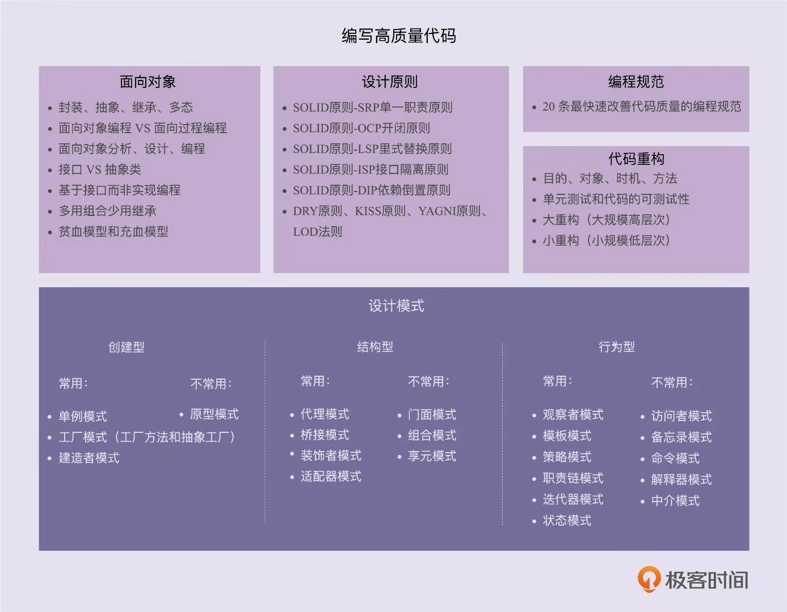

设计模式和算法是教你如何写出高效代码，那设计模式讲的是如何写出可扩展、可读、可维护的高质量代码

## 为什么
为什么学习设计模式
* 面试
* 告别写被人吐槽的烂代码（命名不规范、类设计不合理、分层不清晰、没有模块化概念、代码结构混乱、高度耦合）
* 提高复杂代码的设计和开发能力
* 让读源码、学框架事半功倍
* 为你的职业发展做铺垫

你可能需要考虑的问题
* 如何分层、分模块？
* 如何划分类，每个类应该具有哪些属性、方法？
* 如何设计类之间的交互？
* 改用继承还是组合？
* 该用接口还是抽象类？
* 怎样做到解耦、高内聚低耦合？
* 该使用单例模式还是静态方法？
* 用工厂模式创建对象还是直接 new 出来？
* 如何避免引入设计模式提高扩展性的同时带来降低可读性问题？

## 如何判断代码好坏
对于一段代码质量的评价，常常有很强的主观性。

最常用、最重要的评价标准
* 可维护性：在不破坏原有代码设计、不引入新的 bug 的情况下，能够快速地修改或者添加代码。相反，不易维护就是指修改或者添加代码需要冒着极大的引入新 bug 的风险，并且需要花费很长时间才能完成
  * 可读性好、简洁、可扩展性好就会使得代码易维护
  * 分层清晰、模块化好，高内聚低耦合、遵循基于接口而非实现编程的设计原则等，意味着代码易维护
  * 代码量的多少，业务复杂程度，用到的技术复杂程度，文档是否全面，团队成员的开发水平等
* 可读性：重要指标之一
  * 时刻考虑到代码是否易读。易理解
  * 符合编码规范、命名是否达意、注释是否详尽、函数是否长短合适、模块划分是否清晰、是否符合高内聚低耦合等
* 可扩展性
  * 代表代码应对未来需求变化的能力
  * 不修改或少量修改原有代码的情况下，通过扩展的方式添加新的功能代码
  * 对修改关闭、对扩展开放
* 灵活性
  * 实现新功能，发现原有代码已经预留好了扩展点，不需要修改原有代码，只要在扩展点添加新的代码即可
  * 实现一个功能时，发现原有代码中，已经抽象出了很多底层可以复用的模块、类等代码，可以直接使用
  * 使用某组接口时，这组接口可以应对各种场景的，满足各种需求
* 简洁性
  * 思从深而行从简
  * KISS 原则：Keep it simple stupid
* 可复用性
  * 减少重复代码编写，复用已有的代码
  * 面向对象：继承、多态存在的目的之一，就是提高代码的复用性
  * 设计原则：单一职责原则
  * 重构技巧：解耦、高内聚、模块化
  * SRY 原则
* 可测试性
  * 可测试性差，比较难写单元测试

面向对象设计思想、设计原则、设计模式、编码规范、重构技巧
* 面向对象中的继承、多态能让我们写出可复用代码
* 编码规范能让我们写出可读性好的代码
* 设计原则中的单一职责、DRY、基于接口而非实现、里氏替换原则等，写出可复用、灵活、可读性好、易扩展、易维护的代码
* 设计模式写出易扩展代码
* 持续重构可以时刻保持代码的可维护性

## 联系
主流编程范式有三种：面向过程、面向对象和函数式编程

面向对象
* 四大特性：封装、抽象、继承、多态
* 面向对象和面向过程的区别和联系
* 面向对象分析、面向对象设计、面向对象编程
* 接口和抽象类的区别以及各自的应用场景
* 基于接口而非实现编程的设计思想
* 多用组合少用继承的设计思想
* 面向过程的贫血模型和面向对象的充血模型

设计原则：理解设计的初衷，能解决哪些编程问题，SOLID 原则、DRY 原则、KISS 原则、YAGNI 原则、LOD 原则，其中 SOLID 扩展为
* SRP 单一职责原则
* OCP 开闭原则
* LSP 里氏替换原则
* ISP 接口隔离原则
* DIP 依赖倒置原则

设计模式：解决代码可扩展性问题，了解能解决哪些问题，并懂的不要过度应用，分为三大类：创建型、结构型、行为型

编码规范：相对而言更加具体、更加偏重细节，经典书籍：《重构》、《代码整洁之道》
* 变量、类、函数命名
* 代码注释
* 函数不易过长
* 参数不易过多

代码重构：没有一劳永逸的设计，持续重构是保持代码质量不下降的有效手段

> 在开发初期，除非特别必须，一定不要过度设计，应用复杂的设计模式。而是当代码出现问题的时候，我们再针对问题，应用原则和模式进行重构
* 重构的目的、对象、时机、方法
* 保证重构不出错的技术手段：单元测试和代码的可测试性
* 两种不同规模的重构：大重构（大规模的高层次）和小重构（小规模低层次）

五者之间联系
* 面向对象编程因为其具有丰富的特性，可以实现很多复杂的设计思路，是很多设计原则、设计模式的基础
* 设计原则指导代码设计的经验总结，对是否应该应用某种设计模式，具有指导意义
* 设计模式针对经常遇到的一些设计问题，总结出来的解决方案，设计模式相比设计原则更加具体、更加可执行
* 编程规范主要解决代码可读性问题，更加偏重细节，更加能落地
* 重构作为保持代码质量不下降的有效手段，利用的就是上述理论

总结如下图
