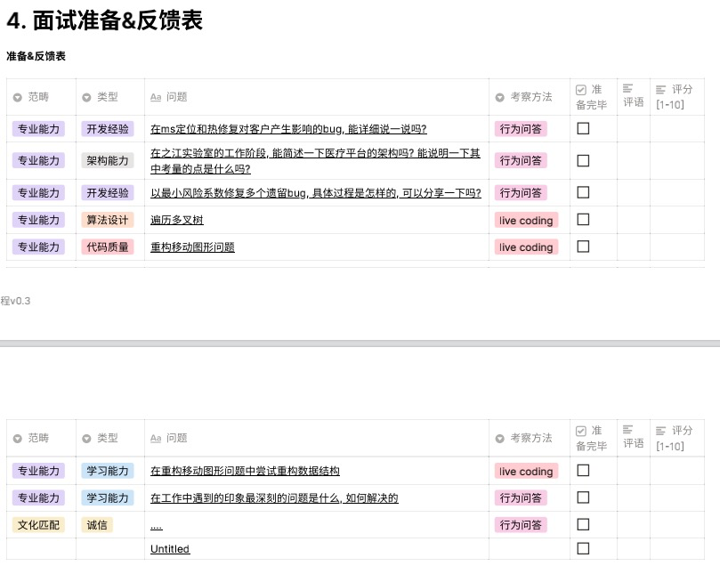

开发者能力模型
* 专业知识
* 代码质量
* 架构能力：系统设计能力，旨在考虑需求和需求变化的前提下，对模块，服务，中间件等系统元素的编排设计能力
* 算法设计
* 开发经验：具体工程问题的调试和解决思路
* ……

考察办法
* 专业知识：知识问答
* 代码质量：live coding
* 架构能力：live coding、白板讲解
* 算法设计：live coding
* 开发经验：场景问答，行为问答

行为问答：举例说明以往工作中解决的问题，注重考察候选人经验，挤干简历水分，通常可以就其细节进一步发文
* 请讲述一个例子, 证明你利用自己的学习能力, 解决了工作中的一个难题
* 讲述一个例子, 说明自己新进入一个行业的时候如何发现业务中的问题, 以及如何研究和解决业务中的问题
* **说一说最近研究的主题**
* 请讲述一个例子, 来说明重要技术选型的时候你是怎么考虑的
* 讲述一下自己在架构方面相关的工作, 当时处理的问题, 以及自己是如何考虑的
* **说一说自己的管理心得**
* 有没有例子自己从零到一带一个团队和空降到一个团队中自己做的事情.
* 什么技术是自己比较了解且比较喜欢的?
* 自己的职业发展规划是怎样的?
* 请讲述一个例子, 当给了一个明显超出自己知识范畴的工作, 你是怎么解决的
* 请讲述一个例子，证明你给自己确立了一个很高的目标，然后完成了这个目标
* 请讲述一个例子，你团结了一群人共同努力，并领导它们取得了成功
* 请讲述一个例子，你在多项任务中，利用已有信息，把不利因素变成有利因素，最后成功完成了这些任务
* 请讲述一个例子，证明使用事实和沟通技巧去说服别人
* 请讲述一个例子，证明你有效的与人合作，共同完成了一件重要的事情
* 请讲述一个例子，你提供了一个创新的想法，使得某项活动或项目取得成功
* 请讲述一个例子，说明你如何评估形势，并把精力放在最重要的事情上，然后取得了比较好的结果
* 请讲述一个例子，证明你获得了技能，并把这些技能转换到实际工作中

面试简单流程
* 准备阶段
  * 确定岗位预期
  * 准备简历相关的考察，至少 3 个（可以针对开发者能力模型，每个方面选择一个问题）
  * 准备一套评估问题
* 匹配阶段
  * 自我介绍
  * 介绍对目标职位的期望
  * 检查人期望是否匹配
* 评测阶段
  * 介绍面试流程
  * 候选人自我介绍
  * 简历发问
  * 评估问题提问
  * 对方提问
* 反馈阶段

举个例子
