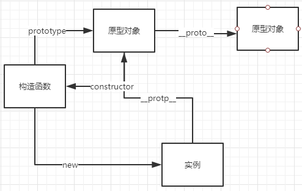

## 面试准备
JD 描述分析、业务分析、技术栈准备、自我介绍

深入思考职位描述（基本功 + 难度）
* 快速判断这个岗位是否是自己喜欢的
* 判断这个岗位是否是自己 hold 住的
* 判断知识准备点：多端（PC/H5/hybrid）、动画、3D、数据 mock、前端组件库、优化点和重构、工程化

业务分析，可以打开其官网，做基本分析，比如基本组件、页面布局、技术选型等

技术栈准备
* 前端技术核心（jQuery、Vue、React、Angular、node）
  * Vue 源码
* 前端工程（Sass、Gulp、less、Grunt、npm、browserify、webpack）

自我介绍
* 简历
  * 基本信息（姓名、年龄、手机、邮箱、籍贯）
  * 学历
  * 工作经历（时间、公司、岗位、职责、技术栈、业绩（技术 + 业务））
  * 开源项目
* 自我陈述
  * 把握面试的沟通方向（很重要）
  * 豁达、自信的适度发挥（心态要和、胆子要大、适时讨疑问）

## 面试技巧
答题技巧和沟通技巧

面试环节
1. 模拟一面（基础）：面试技巧、页面布局、CSS 盒模型、DOM 事件类、HTTP 协议类、原型链类、面向对象类、通信类、前端安全类、前端算法类
2. 模拟二面（原理）：面试技巧、渲染机制类、JS 运行机制类、页面性能、错误监控、MVVM 框架类、双向绑定、设计模式
3. 模拟三面（特色）：面试技巧、业务能力、团队协作能力、带人能力
4. 模拟终面（沟通、性格、潜力）：面试技巧、职业竞争力、职业规划

## 题目演练
开放性题目应尽可能提供更多可能的方案，横向对比优缺点，进一步提高难度，兼容性

#### 三栏布局
* float
* 绝对定位
* flex
* table & table-cell
* grid（需要去掌握，证明积极上进）
```css
.left-center-right {
    display: grid;
    width: 100%;
    grid-template-rows: 100%;
    grid-template-columns: 300px auto 300px;
}
```

#### CSS 盒模型
基本概念：标准模型 + IE 模型

标准模型和 IE 模型区别
* 标准模型的 width 和 height 指的就是 content 的宽高
* IE 模型的 width 和 height 等于 content + padding + border

CSS 如何设置这两种模型：box-sizing

JS 如何设置和获取盒模型对应的宽和高
* 通过 DOM.style.width/height，但只能取内联样式的宽和高
* dom.currentStyle.width/height，仅限 IE
* window.getComputedStyle(dom).width/height
* dom.getBoundingClientRect().width/height

解释边距重叠（父子元素，兄弟元素，空元素）

BFC（或 IFC）
* 格式化上下文
* BFC 原理（解决边距重叠、清楚浮动影响、独立元素、浮动元素参与父元素计算）
* 如何创建 BFC
  * float 不为 none
  * position 值不为 static 或 relative
  * display 为 inline-block/table-cell
  * overflow 不为 visible
* BFC 使用场景

#### DOM 事件类
基本概念：DOM 事件级别
* DOM0：onclick
* DOM2：addEventListener
* DOM3：addEventListener，但增加了很多事件类型

DOM 事件模型：捕获和冒泡

DOM 事件流：捕获阶段 -> 目标阶段 -> 冒泡阶段

DOM 事件捕获的具体流程：window -> document -> html（document.documentElement） -> body -> 子级元素 -> 目标元素

Event 对象常见应用
* event.preventDefault
* event.stopPropagation
* event.stopImmediatePropagation：同一元素多个事件处理场景
* event.currentTarget：当前被绑定事件的元素
* event.target：当前被点击的元素

自定义事件
```js
var eve = new Event('custome')
ev.addEventListener('custome', function() { })
ev.dispatchEvent(eve)
```

#### 类型转换
数据类型：最新标准定义了7种数据类型
* 原始类型：Boolean，Null，Undefined，Number，String，Symbol
* 对象：Object

显式类型装换：显示调用 Number/String/Boolean 函数

Number 函数
* 数值：还是原来的值
* 字符串：可以解析为数值，则转换为相应的数值，否则得到 NaN，空字符串转为 0
* 布尔值：true 转成 1，false 转成 0
* undefined：转成 NaN
* null：转成 0
* 对象：先调用对象自身的 valueOf 方法，如果该方法返回原始类型的值，则直接对该值使用 Number 方法，不再进行后续步骤。如果 valueOf 返回复合类型值，在调用自身的 toString 方法，如果返回原始类型的值，则对该值使用 Number 方法，不再进行后续步骤，如果 toString 返回的是复合类型的值，则报错。

String 函数
* 数值：转为相应的字符串
* 字符串：还是原来的值
* 布尔值：true 转成 'true'，false 转成 'false'
* undefined：转成 'undefined'
* null：转成 'null'
* 对象：先调用对象自身的 toString 方法，如果该方法返回原始类型的值，则直接对该值使用 String 方法，不再进行后续步骤。如果 toString 返回复合类型值，在调用自身的 valueOf 方法，如果返回原始类型的值，则对该值使用 String 方法，不再进行后续步骤，如果 valueOf 返回的是复合类型的值，则报错。

Boolean函数
* undefined、null、-0、+0，NaN，'' 为 false，其余为 true

隐式类型转换
* 四则运算
* 判断语句
* Native 调用（alert，console）

typeof/instanceOf

#### HTTP 协议类
主要特点：简单快速、灵活、无连接、无状态、纯文本

组成部分
* 请求行 请求头 空行 请求体
* 状态行 响应头 空行 响应体

方法：GET/POST/DELETE/PUT/HEAD

POST 和 GET 区别
* GET 在浏览器回退是无害的，而 POST 会再次提交请求
* GET 产生的 URL 地址可以被收藏，而 POST 不可以
* GET 请求会被浏览器主动缓存，而 POST 不会，除非手动设置
* GET 请求只能进行 url 编码，而 POST 支持多种编码方式
* GET 请求参数会被完整保留在浏览器历史记录里，而 POST 中的参数不会被保留
* GET 请求在 URL 中传送的参数是有长度限制的，而 POST 没有限制
* 对参数的数据类型，GET 只接受 ASCII 字符，而 POST 没有限制
* GET 比 POST 更不安全，因为参数直接暴露在 URL 上
* GET 参数通过 URL 传递，POST 方法 body 中

状态码
* 1xx：指示信息，表示请求已接受，继续处理
* 2xx：成功
  * 200：客户端请求成功
  * 206：客户端发送了一个带有 Range 头的请求，服务器完成了它（音频，视频常见）
* 3xx：重定向
  * 301：永久重定向
  * 302：临时重定向
  * 304：缓存命中
* 4xx：客户端错误
  * 400：客户端语法错误
  * 401：未授权
  * 403：禁止访问
  * 404：资源不存在
* 5xx：服务端错误
  * 500：服务器发生不可预期的错误
  * 503：请求未完成，服务临时过载或宕机，一段时间后可能恢复正常

持久连接（1.1版本支持）
* HTTP 协议采用请求-应答模式，当使用普通模式时，即非 Keep-Alive 时，每个请求/应答客户端和服务器都要新建一个链接，完成之后立即断开连接
* 当使用 Keep-Alive 时（又称持久连接、连接复用），Keep-Alive 功能使客户端到服务器端的链接持续有效，当出现对服务器的后继请求时，Keep-Alive 避免了重新建立连接

管线化（1.1版本支持）
* 在使用持久连接的情况下，某个连接上消息的传递类似于 请求1 -> 响应1 -> 请求2 -> 响应2 -> 请求3 -> 响应3
* 管线化：请求1 -> 请求2 -> 请求3 -> 响应1 -> 响应2 -> 响应3
* 管线化通过持久连接完成，因此仅1.1支持
* 只有 GET 和 HEAD 可以进行管线化，POST 有所限制
* 管线化不会影响响应到来的顺序
* 初次创建连接时不应启动管线机制，因为服务器不一定支持 HTTP/1.1 版本的协议
* HTTP/1.1 要求服务器支持管线化，但并不要求服务器端也对响应进行管线化处理，只是要求对于管线化的请求不失败即可
* 由于上面提到的服务器端的问题，开启管线化可能并不会带来大幅度的性能提升，而且很多服务器端和代理程序对管线化支持并不好，因此现在浏览器默认并未开启管线化支持

#### 原型链
创建对象有几种方法
* 声明式
* 显式构造函数
* Object.create

原型、构造函数、实例、原型链，直接见图



需要注意的是
* 只有函数才会有 prototype
* 只有实例对象才会有 `__proto__`，需要注意的事，函数也是对象，因此函数也有`__proto__`属性，它的原型为 Function.prototype，也就是说普通函数是 Function 的实例

instanceOf 原理：判断指定的构造函数是否在实例的原型链上出现过，有点难以理解，看下代码，假设有 M 构造函数和实例 o
```js
o3.__proto__ === M.prototype // true
M.prototype__proto__ === Object.prototype
// 如果需要知道直接构造函数是谁，需要知道 constructor 属性了
```

new 运算符
```js
function objectFactory() {
  var obj = new Object()
  Constructor = [].shift.call(arguments);
  obj.__proto__ = Constructor.prototype;
  var ret = Constructor.apply(obj, arguments);
  return typeof ret === 'object' ? ret : obj;
}
// 可以使用 Object.create 优化
function objectFactory() {
  Constructor = [].shift.call(arguments);
  var obj = Object.create(Constructor.prototype)
  var ret = Constructor.apply(obj, arguments);
  return typeof ret === 'object' ? ret : obj;
}
```

#### 面向对象
类与实例
* 类的声明：函数声明、ES6 class 关键字
* 生成实例

类与继承
* 如何实现继承
* 继承的几种方式

> 其实在我眼里，存在绝对问题的所谓的继承方式都不该叫做继承写法

但在面试中，逐层回答会比较加分（展现深度，不要给面试官问太多题目的机会），因此还是需要记住几种错误的写法，它们的名字是
* 构造函数继承
* 原型继承
* 构造函数 + 原型的组合继承
* 组合继承优化（父构造执行了两次）
* 组合再次优化（无法确定实例到底由子类还是父类构造，需要特别注意 constructor 是否丢失和错误值）

还是看代码吧，不然贼抽象的样子
```js
function Parent() {}

function Child() {
    Parent.call(this) // 方式一关键代码
}

Child.prototype = new Parent() // 方式二关键代码

// 组合起来就是方式三

// 由于执行了两次，因此将方式二关键代码修改为 -- 方式四
Child.prototype = Parent.prototype

// 由于无法确定由谁实例化，再次优化为 -- 方式五
Child.prototype = Object.create(Parent.prototype) // 隔离
Child.prototype.constructor = Child
```

#### 通信类
什么是同源策略及限制
* 源：协议、域名、端口
* 同源策略限制从一个源加载的文档或者脚本如何与来自另一个源的资源进行交互，用于隔离潜在恶意文件的关键的安全机制
* 主要限制内容
  * Cookie、LocalStorage 和 IndexDB 无法获取
  * DOM 无法获得
  * AJAX 请求不能发送

前后端如何通信
* AJAX
* WebSocket
* CORS

如何创建Ajax
* XMLHttpRequest对象的工作流程
* 兼容性处理
* 事件的触发条件
* 事件的触发顺序

跨域通信的几种方式
* JSONP：利用 script 标签的异步加载实现的。
* Hash：利用 Hash 的改变不会触发页面刷新，可以通过 onhashchange 事件监听到变化，通过 window.location.hash 得到数据，应用场景：嵌 iframe 的多窗口不同源通信。
* postMessage：H5标准，主要利用 postMessage Api + message 事件。
* WebSocket：onopen、onmessage、onclose
* CORS

#### 前端安全
CSRF
* 基本概念和缩写：跨站请求伪造
* 攻击原理：已登录验证下发cookie，网站接口本身存在漏洞
* 防御措施：token 验证、Referer 验证、隐藏令牌

XSS
* 跨域脚本工具
* 攻击原理：不需要登录，注入JS脚本
* 防御措施：使得脚本不可执行

#### 算法
排序
* 快速排序（https://segmentfault.com/a/1190000009426421）
* 选择排序（https://segmentfault.com/a/1190000009366805）
* 希尔排序（https://segmentfault.com/a/1190000009461832）
* 冒泡排序

堆栈、队列、链表（https://juejin.im/entry/58759e79128fe1006b48cdfd）

递归（https://segmentfault.com/a/1190000009857470）

波兰式和逆波兰式

原则
1. 先准备理解题目意思
2. 伪代码，分解问题
3. 如果实在写不出，但是似曾相似，也可以将基本思路说出来

## 知识梳理

#### 渲染机制
什么是DOCTYPE及作用：DTD（文档类型定义）是一系列语法规则，用来定义XML或（X）HTML的文件类型，浏览器使用它来判断文档类型，决定使用何种协议来解析，以及切换浏览器模式。

DOCTYPE 是用来声明文档类型和 DTD 规范的，一个主要的用途便是文件的合法性规则。如果文件代码不合法，那么浏览器解析时便会出一些差错。HTML 4.0 声明非常复杂，有一个严格模式和传统模式，HTML5就比较简单了，直接在 html 元素上添加`!DOCTYPE`。

浏览器渲染过程
1. HTML 解析成 DOM Tree
2. CSS 解析成 Style Tree
3. HTML Tree 和 Style Tree 整合成 Render Tree（Layout 计算位置）
4. Painting

重排Reflow：DOM结构中各个元素都有自己的盒模型，这些都需要浏览器根据各种样式来计算结果将元素放到它该出现的位置，这个过程称为 reflow。

触发 reflow
* 增加、删除、修改 DOM 节点时，会导致 reflow 或 repaint
* 移动 DOM 的位置或动画
* 修改某些 CSS 样式
* Resize 窗口的时候或者滚动的时候
* 修改网页默认字体

重绘Repaint：当各种盒子的位置、大小以及其他属性，例如颜色、字体大小等确定下来后，浏览器于是便把这些元素都按照各自的特性绘制了一遍，于是内容就出现了，这个过程称为repaint。

触发 repaint
* DOM 改动
* CSS 改动

如果尽可能降低 repaint 频率：HTML 碎片

布局Layout

#### JS 运行机制
理解 JS 单线程机制

什么是任务队列

什么是 Event Loop

理解哪些语句会放入异步任务队列中，和放入异步任务队列的时机

#### 页面性能
提升页面性能的方法有哪些
1. 资源压缩合并，减少 HTTP 请求，开启 gzip 压缩
2. 非核心代码异步加载 -> 异步加载的方式 -> 异步加载的区别
3. 利用浏览器缓存 -> 缓存分类 -> 缓存原理
4. 使用 CDN
5. 预解析 DNS
```html
<meta http-equiv="x-dns-prefetch-control" content="on"> // 一般而言，A 标签的链接，在高级浏览器中默认打开 dns 预解析，但如果使用 HTTPS 协议，很多浏览器默认关闭，通过这个强制开启
<link ref="dns-prefetch" href="">
```

异步加载
1. 动态脚本加载
2. defer：HTML 解析完之后才会执行，如果是多个，按照加载的顺序依次执行
3. async：加载完之后立即执行，如果是多个，执行顺序和加载顺序无关

浏览器缓存
* 强缓存：Expires（绝对时间）、Cache-Control（相对时间，优先级比 Expires 搞）
* 协商缓存：Last-Modified，If-Modified-Since，Etag，If-None-Match
  * Last-Modified 和 Etag 是服务器下发的
  * If-Modified-Since 和 If-None-Match 请求头携带上述服务器下发的值，去服务端对比

#### 错误监控

## 复习指导
注意事项、复习指南

## 真题解析
九宫格、阿里笔试题、函数和对象、算法题