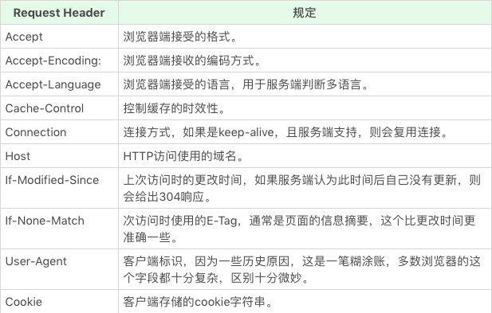
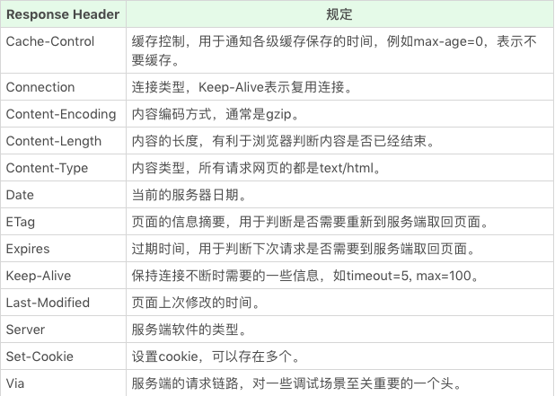

## HTML

### 语义化标签
div 和 span 不是够用了么。

所以就来谈谈语义类标签，它们的特点是视觉表现上互相都差不多，主要的区别在于它们表示了不同的语义，比如经常见到的 section、nav、p 这些都是语义类的标签。

为什么现在大家的意思都是 div 和 span 走天下呢？这是因为在现代互联网产品里，HTML 用于描述“软件界面”多过于“富文本”，而软件界面里的东西，实际上几乎是没有语义的。因此在任何“软件界面”的场景中，可以直接使用 div 和 span。

但在很多工作场景中，语义类标签也有它们自己无可替代的优点。正确的使用予以标签可以带来很多好处。
* 对开发者更为友好，使用语义类标签增强了可读性，即便在没有 CSS 的时候，开发者也能够清晰的看出网页的结构，也更为便于团队的开发和维护。
* 除了对人类友好外，语义类标签也十分适宜机器阅读。文字表现力丰富，更适合引擎检索（SEO），还可以支持读屏软件，根据文章自动生成目录等等。

> 不恰当使用语义标签，反而会造成负面作用。错误的使用语义标签，会给机器阅读造成混淆、增加嵌套，给 CSS 编写加重负担。因此：“用对”比“不用”好，“不用”比“用错”好。当然有理想的工程师还是应该去追求用对他们。

几个语义化场景
* 自然语言表达能力的补充
* 文章标题摘要
* 适合机器阅读的整体结构

常用语义化标签
* ruby、rt、rp
* em（表示重音）
* h、p、hgroup
* section、header、nav、aside、footer、address、article
  * header：通常出现在前部，表示导航或介绍性的内容
  * footer：出现在尾部，包含作者信息、相关链接、版权信息等
  * aside：表示和文章主题不那么相关的部分，可能包含导航、广告等工具性质的内容，本身很容易被理解为侧边栏，实际上两者是包含关系，侧边栏是 aside，aside 不一定是侧边栏
  * address：表示作者联系方式，明确地只关联到 article 和 body

### 元信息标签
元信息是指自身的信息，元信息类标签，就是 HTML 用于描述文档自身的一类标签，通常出现在 head 标签中。元信息多数情况下是给浏览器、搜索引擎等机器阅读的。

head 标签本身并不携带任何信息，主要作为盛放其他语义类标签的容器使用。head 标签规定了自身必须是 html 标签中的第一个标签，它的内容必须包含一个 title，并且最多只能包含一个 base。如果文档作为 iframe，或者有其他方式指定了文档标题时，可以允许不包含 title 标签。

title 作为元信息，可能会被用在浏览器收藏夹、微信推送卡片、微博等各种场景，这时候往往是上下文缺失的，所以 title 应该是完整地概括整个网页内容的。

base 标签是一个历史遗留标签，作用是给页面上所有的 URL 相对地址提供一个基础，最多只有一个，它改变全部的链接地址，是一个非常危险的标签，容易造成跟 JS 的配合问题，所以实际开发中，建议你使用 JS 来代替 base 标签。

meta 标签是一组键值对，是一种通用的元信息表示标签。head 中可以出现任意多个 meta 标签，一般由 name 和 content 两个属性来定义，name 表示元信息的名，content 则用于表示元信息的值。这个 name 是一种比较自由的约定，http 标准规定了一些 name 作为大家使用的共识，也鼓励大家发明自己的 name 使用。除了基本用法，meta 标签还有一些变体，主要用于简化书写方式或者声明自动化行为。

charset 属性：添加了 charset 属性的 meta 标签无需再有 name 和 content。charset 型 meta 标签非常关键，它描述了 HTML 文档自身的编码形式，因此建议这个标签放在 head 的第一个，因为浏览器在读到这个标签之前，处理的所有字符都是 ASCII 字符，ASCII 字符是 UTF-8 和绝大多数字符编码的子集，所以在读到 meta 之前，浏览器把文档理解大多数编码格式都不会出错，这样可以最大程度保证不出现乱码。

http-equiv 属性：表示执行一个命令，这样的 meta 标签可以不需要 name 属性了。比如下面一段代码相当于添加了 content-type http 头，并且指定了 http 编码方式
```html
<meta http-equip="content-type" content="text/html; charset=UTF-8">
```

除了 content-type，还有以下几种命令
* content-language：指定内容的语言
* default-style：指定默认样式表
* refresh：刷新
* set-cookie 模拟 http 头 set-cookie，设置 cookie
* x-ua-compatible 模拟 http 头 x-ua-compatible，声明 ua 兼容性
* content-security-policy 模拟 http 头 content-security-policy，声明内容安全策略

meta 标签可以被自由定义，只要写入和读取的双方约定好 name 和 content 格式就可以了。接下来看一个 meta 类型，没有在 HTML 标准中定义，确实移动端开发的事实标准：viewport。这类 meta 的 name 为 viewport，它的 content 是一个复杂结构，是用逗号分隔的键值对，键值对的格式是 key=value

viewport 能控制的全部属性如下
* width：页面宽度，可以取具体数值，也可以是 device-width，表示和设备宽度相等
* height：页面高度，可以取值具体数值，也可以是 device-height，表示跟设备高度相等
* initial-scale：初始缩放比例
* minimum-scale：最小缩放比例
* maximum-scale：最大缩放比例
* user-scalable：是否允许用户缩放

对于已经做好了移动端适配的网页，应该把用户缩放功能禁止掉，宽度设为设备宽度，一个标准的 meta 如下
```html
<meta name="viewport" content="width=device-width,initial-scale=1,minimum-scale=1,maximum-scale=1,user-scalable=no">
```

其他预定义的 meta
* author：页面作者
* description：页面描述，这个属性可能被用户搜索引擎或者其他场合
* generator：生成页面所使用的工具，主要用于可视化编辑器
* keywords：页面关键字，对于 SEO 场景非常关键
* referrer：跳转策略，是一种安全考量
* theme-color：页面风格颜色，实际并不会影响页面，但是浏览器可能据此调整页面之外的UI

## 类型系统
JavaScript 语言规定了 7 种语言类型
1. Undefined
2. Null
3. Boolean
4. String
5. Number
6. Symbol
7. Object

为什么有的编程规范要求用 void 0 代替 undefined ？

Undefined 类型表示未定义，他的类型只有一个值，就是 undefined。任何变量在福之前是 Undefined 类型，值为 undefined。一般我们可以用全局变量 undefined 来表达这个值，或者 void 运算来把任意一个表达式变成 undefined 值。

问题在于 JavaScript 的代码中 undefined 只是一个变量，而不是关键字，首先明确一点，这是 JavaScript 语言公认的设计失误之一，所以为了避免无意中被篡改，建立使用 void 0 来获取 undefined 值。

> 在ES5之前的时候，undefined 是可以被赋值的。在现代浏览器当中已经把 undefined 设置为一个 non-configurable, non-writable属性的值了。

Undefined 跟 null 有一定的表意差别，null 表示定义了但是为空。因此在实际编程时，我们一般不会把变量赋值为 undefined，这样可以保证所有值为 undefined 的变量，都是未赋值的自然状态。

Null 类型也只有一个值，就是 null，他的语义表示空值，与 undefined 不同的是，null 是 JavaScript 关键字，所以在任何代码中，你都可以放心用 null 关键字来获取 null 值。

String 是否有最大长度？

String 理论上最大长度是 2^53 - 1，这也是 JS 中可表达的最大安全整数。这在一半开发中都是够用的，但有趣的事，这个所谓最大长度，并不完全是你理解中的字符数。因为 String 的意义并未字符串，而是字符串的 UTF-16 编码，同时我们的字符串的操作 charAt、charCodeAt、length 等方法针对的都是 UTF-16 编码。因为字符串的最大长度，实际上是受字符串编码长度影响的。

JavaScript 中的字符串是永远无法变更的，一旦字符串构造出来，无法用任何方式改变字符串，所以字符串具有值类型的特征。

JavaScript 中的 Number 类型有 2^64 - 2^53 + 3 个值？这是为什么？

JavaScript 中的 Number 类型基本符合 IEEE 754-2008 规定的双精度浮点数规则，但是 JavaScript 为了表达几个额外的语言场景（比如不让除以 0 出错，而引入了无穷大的概念），规定了几个例外情况：
* NaN
* Infinity
* -Infinity

> 值得注意的是，JavaScript 中有 +0 和 -0，在加法类运算中它们没有区别，但是除法的场合则需要特别留意区分。区分 +0 和 -0 的方式，正是检测 1/x 是 Infinity 还是 -Infinity

根据双进度浮点数的定义，Number 类型中有效的整数范围是 -0x1fffffffffffff 至 0x1fffffffffffff，所以 Number 无法精确表示此范围外的整数。

同样根据浮点数的定义，非整数的 Number 类型无法用 ==（=== 也不行）来比较。比如 0.1 + 0.2 == 0.3 问题。因为浮点数运算的精度问题导致等式左右的结果并不是严格相等，而是相差了个微小的值。因此正确的比较方法是使用 JavaScript 提供的最小精度值，检查等式左右两边差的绝对值是否小于最小精度，才是正确的比较浮点数的方法。
```js
console.log(Math.abs(0.1 + 0.2 - 0.3) <= Number.EPSILON)
```

Symbol 是 ES6 中引入的新类型，它是一切非字符串的对象 key 的集合，在 ES6 规范中，整个对象备用 Symbol 重塑。Symbol 可以具有字符串类型的描述，但是即使描述相同，Symbol 也不相等。创建 Symbol 使用全局的 Symbol 函数即可。

在 JavaScript 中的几个基本类型，都在对象中有一个亲戚，分别是
* Number
* String
* Boolean
* Symbol

其中 Number、String 和 Boolean，三个构造器是两用的，当跟 new 搭配时，它们产生对象，当直接使用时，表示强制类型转换。Symbol 函数比较特殊，直接用 new 调用它会抛出错误，但它仍然是 Symbol 对象的构造器。

为什么给对象添加的方法能用在基本类型上？因为.运算符提供了装箱操作，他会根据基础类型构造一个临时对象，使得我们能在基础类型上调用对应对象的方法。

### 类型转换
因为 JS 是弱类型语言，所以类型转换发生非常频繁，大部分我们熟悉的运算（比如加减乘除大于小于双等于）都会先进行类型转换。

其实最臭名昭著的是 JS 中的 == 运算，因为试图实现跨类型的比较，但它的规则复杂到几乎没人可以记住。因此很多实践中认为 == 运算符属于设计失误，要求程序员进行显示的类型转换后，用 === 比较。

#### StringToNumber
先看看数字的不同表示
* 30 十进制
* 0b111 二进制
* 0o13 八进制
* 0xff 十六进制
* 1e3 || -1e01 正负号科学计数法

但是 parseInt 和 parseFloat 并不使用这个转换，所以支持的语法跟这里不尽相同。在不传入第二个参数的情况下，parseInt 只支持 16 进制前缀'0x'，而且会忽略非数字字符，而不支持科学计数法。

因为在任何情况下，都建议传入 parseInt 的第二个参数，该参数表示上述字符串的基数。而 parseFloat 则直接把原字符串作为十进制来解析，它不会引入任何其他机制。

多数情况下，Number 是比 parseInt 和 parseFloat 更好的选择。

顺便谈谈 NumberToString，在较小的范围内，数字和字符串的转换是完全符合你直觉的十进制表示。当 Number 绝对值较大或者较小时，字符串表示则是使用科学计数法表示的。

### 装箱转换
每一种基本类型 Number、String、Boolean、Symbol 在对象中都有对应的类，所谓装箱转换，正是把基本类型转换为对象的对象，它是类型转换中一种相当重要的种类。

装箱机制会频繁产生临时对象，在一些对性能要求较高的场景下，应该尽量避免对基本类型做装箱转换。

每一类装箱对象皆有私有的 Class 属性，这些属性可以用 Object.prototype.toString 获取，在 JS 中，没有任何方法可以更改私有的 Class 属性，因此 Object.prototype.toString 是可以准确识别对象对应的基本类型的方法，它比 instanceOf 更加准确。

### 拆箱转换
在 JS 中规定了 ToPrimitive 函数，他是对象类型到基本类型的转换。对象到 String 和 Number 的转换都遵循“先拆箱再转换”的规则。通过拆箱转换，把对象变成基本类型，再从基本类型转换为对应的 String 或者 Number。拆箱转换会尝试调用 valueOf 和 toString 来获得拆箱后的基本类型，如果均不存在或者没有返回基本类型，则会产生类型错误 TypeError。

在 ES6 之后，还允许对象通过显示指定 toPrimitive Symbol 来覆盖原有的行为
```js
o[Symbol.toPrimitive] = () => {}
```

### 总结
程序 = 算法 + 数据结构，运行时类型包含了所有 JavaScript 执行时所需要的数据结构的定义，所以需要格外重视。

“类型”在 JavaScript 中是一个有争议的概念。一方面，标准中规定了运行时数据类型； 另一方面，JS 语言中提供了 typeof 这样的运算，用来返回操作数的类型，但 typeof 的运算结果，与运行时类型的规定有很多不一致的地方。特别需要注意的是：null -> object。

## 类与对象
首先我们思考一个问题？为什么额 JS （直到 ES6）有对象的概念，却一直没有像其他语言一样，有类的概念呢？

甚至有人强调：JS 并非面向对象语言，而是基于对象语言，事实上基于对象和面向对象两个形容词都出现在了 JS 标准的各个版本中。

> JS 标准对基于对象的定义：语言和宿主的基础设施由对象来提供，并且 JS 程序即是一系列互相通讯的对象集合。

在不同的编程语言中，设计者也利用各种不同语言特性来抽象描述对象，最为成功的流派是使用类的方式来描述对象，比如 C++、Java 等，而 JS 早年却选择了一个更为冷门的方式：原型。由于政治原因，JS 被要求模仿 Java，所以 JS 创始人在原型运行时的基础上引入了 new、this 等语言特性。

对象的基本特征（标识性、状态和行为）
* 对象具有唯一标识性：即使完全相同的两个对象，也并非同一个对象（一般而言，各种语言的对象唯一标识性都是用内存地址来体现的）
* 对象有状态：对象具有状态，同一对象可能处于不同状态之下
* 对象具有行为：即对象的状态可能因为行为产生变迁

> 对于第二个和第三个特性，状态和行为，不同语言使用不同的术语来抽象描述它们，C++ 称为成员变量和成员函数，Java 中称它们为属性和方法。在 JS 中统一抽象为属性。

为了提高抽象能力，JS 的属性被设计成比别的语言更加复杂的形式，它提供了数据属性和访问器属性（getter/setter）两类。

数据属性具有四个特征
* value：属性的值
* writable：能否被赋值
* enumerable：决定 for in 能否枚举该属性
* configurable：决定该属性能否被删除或者改变特征值

访问器属性也有四个特征
* getter：函数或 undefined，在取属性值时被调用
* setter：函数或 undefined，在设置属性值时被调用
* enumerable
* configurable

通常 writable、enumerable、configurable 默认为true，可以使用内置函数 Object.getOwnPropertyDescriptor 来查看。如果想改变属性的特性或者定义访问器属性，使用 Object.defineProperty。

在创建对象时，可以使用 get、set 关键字来创建访问器属性。

实际上 JS 对象的运行时是一个属性的集合，属性以字符串或者 Symbol 为 key，以数组属性特征值或者访问器属性特征值为 value。

> 我们应该在理解其设计思想的基础上充分挖掘它的能力，而不是机械地模仿其他语言

模拟面向对象？事实上 JS 本身就是面向对象的，并不需要模拟，主要是因为它实现的面向对象的方式和主流的流派不太一样，所以才让人产生了误解。这种模拟面向对象，实际上做的事情就是模拟基于类的面向对象。

但是半吊子的模拟，缺少了继承等关键特性，导致大家视图对它进行花式修补，进而产生了种种互不相容的解决方案。因此 ES6 开始，JS 提供了 class 关键字来定义类，尽管如此，这样的方案仍然是基于原型运行时系统的模拟，但是修正了一些常见的坑，同意了社区的方案，这对语言的发展有着非常大的作用。

基于类与基于原型
* 基于类的编程提倡使用一个关注分类和类之间关系开发模型。在这类语言中，总是现有类，再从类去实例化一个对象。类与类之间有可能会形成继承、组合等关系。类又往往与语言的类型系统整合，形成一定编译时的能力
* 基于原型更为提倡程序员去关注一系列对象实例的行为，而后才去关心如何将这些对象，划分到最近的使用方式相似的原型对象，而不是将它们分成类

原型系统的复制操作有两种实现思路
* 一个是并不真的去复制一个原型对象，而是使得新对象持有一个原型的引用（JS 属于这种啦）
* 另一个是切实的复制对象，从此两个对象再无关联

原型系统简单概括
* 如果所有对象都有私有字段[[prototype]]，就是对象的原型
* 读一个属性，如果对象本身没有，则会继续访问对象的原型，直到原型为空或者找到位置

ES6 中提供了一系列内置函数，以便更为直接的访问操作原型，三个方法分别为
* Object.create 根据指定的原型创建新对象，原型可以是 null
* Object.getPrototypeOf 获得一个对象原型
* Object.setPrototypeOf 设置一个对象原型

在早期版本的 JS 中，类的定义是一个私有属性[[class]]，语言标准为内置类型诸如 Number、String、Date 等指定了 [[class]] 属性，以表示它们的类。语言使用者唯一可以访问 [[class]] 的方式是 Object.prototype.toString。因此在 ES3 和之前的版本，JS 中类的概念是相当弱的，仅仅是运行时的一个字符串属性。

从 ES5 开始，[[class]] 被 Symbol.toStringTag 代替，Object.prototype.toString 的意义从命名上不再和 class 相关。我们甚至可以定义 Object.prototype.toString 的行为
```js
var o = { [Symbol.toStringTag]: 'MyObject'}
Object.prototype.toString(o) // [object Object]
o.toString() // [object MyObject]
```

new 操作
* 以构造器的 prototype 属性（注意与私有字段[[prototype]]区分）为原型，创建新对象
* 将 this 和调用参数传给构造器，执行
* 如果构造器返回的是对象，则返回，否则返回第一步创建的对象

因此 new 客观上提供了两种方式，一是在构造器中添加属性，二是在构造器的 prototype 属性上添加属性。

在没有 Object.create、Object.setPrototypeOf 的早期版本中，new 运算时唯一一个可以指定 [[prototype]] 的方法（尽管我们可以看到`__proto__`，但并不是标准）

### ES6 中的类
ES6 中加入了新特性 class，new 根 function 搭配的怪异行为终于可以退休了（虽然运行时没有改变），在任何场景，我们都推荐使用 ES6 的语法来定义类，而令 function 回归原本的函数定义。

ES6 中引入了 class 关键字，并且在标准中删除了所有 [[class]] 相关的私有属性描述，类的概念正式从属性升级为语言的基础设施。

在现有类语法中，getter/setter 和 method 是兼容性最好的。通过 get/set 关键字创建 getter，通过括号和大括号来创建方法，数据型成员最好写在构造器中。

此外，最重要的事，类提供了继承能力，比起早起的原型模拟方式，使用 extends 关键字自动设置了 constructor，并且会自动调用父类的构造函数，这是一种更少坑的设计。

### 对象分类
JS 对象可以分成如下几类
* 宿主对象：由 JS 宿主环境提供的对象，它们的行为完全由宿主环境决定
* 内置对象：由 JS 语言提供的对象
  * 固有对象：由标准规定，随着 JS 运行时创建而自动创建的对象实例
  * 原生对象：可以由用户通过 Array、RegExp 等内置构造器或者特殊语法创建的对象
  * 普通对象：由{}语法，Object 构造器或者 class 关键字定义类创建的对象，它能够被原型继承

在 JS 中，还有一个看待对象的不同视角，就是用对象来模拟函数和构造器。

函数对象的定义是：具有[[call]]私有字段的对象，构造器对象的定义是：具有私有字段[[construct]]的对象。

用户用 function 关键字创建的函数必定同时是函数和构造器。不过他们表现出来的行为却不相同，对于宿主和内置对象而言，它们实现的[[call]]和[[construct]]并不总是一致。比如 Date、Image、String、Number、Boolean 等

## CSS 语法
CSS 顶层样式表由两种规则组成的规则列表构成，一种被称为 at-rule，也就是 at 规则，另一种是 qualified rule，也就是普通规则
* at-rule 由一个 @ 关键字和后续的一个区块组成，如果没有区块，则以分号结束
* qualified rule 则是指普通的 CSS 规则，也就是我们所熟识的，由选择器和属性指定构成的规则

这里先简单了解下 at-rule
* @charset：提示 CSS 文件使用的字符编码方式，如果被使用，必须出现在最前面
* @import：引入一个css 文件，除了 @charset 规则不会被引入，可以引入另一个文件全部内容
```css
@import [ <url> | <string> ]
        [ supports( [ <supports-condition> | <declaration> ]) ]?
        <media-query-list>
```
* @media：对设备的类型进行一些判断，在 media 的区块内，是普通规则列表
* @page：用于分页媒体访问网页时的表现设置，页面是一种特殊的盒模型结构，除了页面本身，还可以设置它周围的盒
* @counter-style：产生一种数据，用于定义列表项的表现
* @keyframes：定义动画关键帧
* @fontface：定义一种字体，icon font 技术就是利用这个特性实现的
* @supports：检查环境的也行，与 media 比较类似
* @namespace：用于跟 XML 命名空间配合的一个规则，表示内部的 CSS 选择器全都带上特定的命名空间
* @viewport：用于设置视口的一些特性，兼容性目前不是很好，通常被 html 的 meta 代替

接下来看看普通规则
* 选择器
* 声明列表
  * 属性
  * 值
    * 值类型
    * 函数

选择器语法结构
* 连接符
  * 空格：后代，选中它的子节点和所有子节点的后代节点
  * `>`：子代，选中它的子节点
  * +：直接后继选择器，选中它的下一个相邻节点
  * ~：后继，选中它之后所有的相邻节点，只作用一层
  * ||：列，选中表格中的列
* 选择器组合
  * 类型选择器
  * 子类选择器（id、class、attribute，pseudo-class）
  * 伪元素

CSS 属性值就比较丰富了，有关键字、字符串、URL、整数/实数、维度（单位的整数/实数）、百分比、颜色、图片、2D 位置和函数。

CSS 支持一批特定的计算型函数：calc、max、min、clamp、toggle、attr

> calc 函数是基本的表达式计算，支持加减乘除四则运算。在针对维度进行计算时，calc 函数允许不同单位混合运算，这非常有用。

## 浏览器
首先了解下 HTTP 协议，特别需要知道是 HTTP 是纯粹的文本协议，规定了使用 TCP 协议来传输文本的一个应用层协议。

由于是文本协议，那么如何区分各个部分呢？此时换行符扮演者重要的角色了。

在请求部分，第一行被称作 request line，分为三个部分，HTTP Method，请求路径和请求的协议和版本

在响应本文，第一行被称作 response line，也分为三个部分，协议和版本、状态码和状态文本。

紧随在 request line 或者 response line 之后，是请求头/响应头，这些头由若干行组成，每行是用冒号分隔的名称和值。

在头之后，以一个空行（两个换行符）为分隔，是请求体/响应体，请求体可能包含文件或者表单数据，响应体则是 html 代码。

关于 HTTP 协议这一块，还需要知道有 HTTP Methods，常见的 Status code，常见的 HTTP Head，这里给出两张截图，这部分应该是前端工程师应该做到不需要查阅，看到就可以知道意思的 HTTP 头。由于 HTTP 协议有深入学习过，就不多写笔记了。

request head



response head



常见的 body 格式为
* application/json
* application/x-www-form-urlencoded
* multipart/form-data
* text/xml

HTTPS有两个作用：一个确定请求的目标服务端身份，二是保证传输的数据不会被网络中间节点窃听或者篡改

HTTP 2.0 最大的改进有两点：一是支持服务端推送，二是支持 TCP 连接复用
* 服务端推送能够在客户端发送第一个请求到服务端时，提前把一部分内容推送到客户端，放入缓存中
* TCP 连接复用，使用同一个 TCP 连接来传输多个 HTTP 请求，避免三次握手开销和初建 TCP 连接时传输窗口小的问题

### DOM 树
通过 HTTP 协议，我们就得到了字符流。接下来的工作就是如何解析请求回来的 HTML 代码，DOM 树是如何构建的

> 具体流程：字符流 -> 状态机 -> 词 token -> 栈 -> DOM 树

HTML 结构不算太复杂，日常开发需要用到的 90% 词，种类大约只有标签开始、标签属性、标签结束、注释、CDATA 节点几种

我们从 HTTP 协议收到的字符流读取字符，在接受第一个字符前，我们无法判断这是哪一个词，但随着接受的字符越来越多，拼出其他的内容的可能性就会越少，接下来一直读，知道遇到`>`或者空格，这样就得到了一个完整的词（token）了。实际上，我们每读入一个字符，其实都要做一次决策，而且这些决定是跟当前状态有关的。在这样的条件下，浏览器工程师要想实现把字符流解析成 token，最常见的方案就是使用状态机。

接下来我们需要把简单的词变成 DOM 树，这个过程使用栈来实现，通过这个栈，我们可以构建 DOM 树
* 栈顶元素就是当前节点
* 遇到属性就添加到当前节点
* 遇到文本节点，如果当前节点是文本节点，则跟文本节点合并，否则入栈成为当前节点的子节点
* 遇到注释节点，作为当前节点的子节点
* 遇到 tag start 就入栈一个节点，当前节点就是这个节点的父节点
* 遇到 tag end 就出栈一个节点（还检查是否匹配）

### CSS 计算
首先 CSS 选择器这个名称，可能会给你带来一定的误解，觉得好像 CSS 规则是 DOM 树构建好了之后，在进行选择并给它添加样式的。实际上这个过程并不是这样。

浏览器会尽量流式处理整个过程。构建 DOM 的过程是：从父到子，从先到后，一个一个节点构造，并且挂载到 DOM 树上的，显然在这个过程可以同步把 CSS 属性计算出来。在这个过程中，我们依次拿到上一步构造好的元素，去检查它匹配到了哪些规则，再根据规则优先级，做覆盖和调整。所以从这个角度看，所谓的选择器，应该被理解成“匹配器”才更合适。

选择器有个特点，那就是选择器的出现顺序，必定跟构建 DOM 树的顺序一致。这是一个 CSS 设计的原则，即保证选择器在 DOM 树构建到当前节点时，已经可以准确判断是否匹配，不需要后续节点信息。

也就是说，未来也不可能出现“父元素选择器”这种东西，因为父元素选择器要求根据当前节点的子节点，来判断当前节点时候被选中，而父元素会先于子节点构建。

### 排版
给 DOM 元素添加了用于展现的 CSS 属性，接下来浏览器的工作就是确定每一个元素的位置了。基本原则仍然不变，就是尽可能流式的处理上一步骤的输出。

在构建 DOM 树和计算 CSS 属性这两个步骤，我们的产出是一个一个的元素，但是排版的这个步骤中，有些情况就没法做到这样，尤其是在表格相关排版、flex 排版和 grid 排版，它们有个显著的特点，就是子元素之间具有关联性。

浏览器最基本的排版方案是正常流排版，它包含了顺次排布和拆行等规则。

在正常流的基础上，浏览器还支持两类元素：绝对定位元素和浮动元素
* 绝对定位元素把自身从正常流抽出，直接由 top 和 left 等属性确定自身的位置，不参加排版计算，也不影响其他元素
* 浮动元素则是使得自己在正常流的位置向左或者向右移动到边界，并且占据一块排版空间。float 元素非常特别，浏览器对 float 的处理是先排入正常流，再移动到排版宽度的最左/最右，移动之后 float 元素占据了一块排版的空间，因此，在数行内，主轴方向的排版距离发生了变化，直到交叉轴方向的尺寸超过了浮动元素的交叉轴尺寸范围，主轴排版尺寸才回恢复，float 元素排布完成后，float 元素所在的行需要重新确定位置。

### 渲染、合成、绘制
经历了上述步骤后，最后就是根据这些样式信息和大小信息，为每个元素在内存中渲染它的图形，并且把它绘制到对应的位置。

渲染在图形学的意义，把模型变成位图的过程。这里的位图就是内存里建立一张二维表格，把一张图片的每个像素对应的颜色保存进去（位图信息也是 DOM 树中占据浏览器内存最多的信息，我们在做内存占用优化时，主要就是考虑这一部分）

浏览器中渲染这个过程，就是把每一个元素对应的盒变成位图。这里的元素包括 HTML 元素和伪元素，一个元素可能对应多个盒子（比如 inline 元素，可能会分成多行）。每一个盒对应着一张位图。

这个渲染过程是非常复杂的，但是总体来说，可以分成两个大类：图形和文字。

渲染的过程中，是不会把子元素会知道渲染的位图上的，这样，当父子元素的相对位置发生变化时，可以保证渲染的结果能够最大程度被缓存，减少重新渲染。

由于渲染过程不会把子元素渲染到位图上面，合成的过程，就是为一些元素创建一个“合成后的位图”，把一部分子元素渲染到合成的位图上面。

合成的策略
* 原则：最大限度的减少绘制参数
* 极端例子：所有元素都进行合成，比如为根元素 html 创建一个合成后的位图，把所有子元素都进行合成，那么一旦用 JS 改变了任何一个 CSS 属性，这份合成后的位图就失效了，我们需要重新绘制所有的元素，如果所有的元素都不合成，结果就是相当于每次都必须重新绘制所有元素，这也不是性能友好的选择
* 好的合成策略：猜测可能变化的元素，把它排除到合成之外

目前主流浏览器一般根据 position、transform 等属性来决定合成策略，来猜测这些元素未来可能发生变化。但是这样的猜测准确性有限，所以新的 CSS 标准中，规定了 will-change 属性，可以由业务代码来提示浏览器的合成策略，灵活运用这样的特性，可以大大提升合成策略的效果。

绘制：把位图最终绘制到屏幕上，变成肉眼可见的图像。一般而言，浏览器并不需要用代码来处理这个过程，只需要把最终显示的位图交给操作系统即可。一般最终显示的位图位于显存中，也有一些情况下，浏览器只需要把内存中的一张位图提交给操作系统或者显示驱动就可以了。

总结：浏览器中的位图操作部分，包括了渲染、合成和绘制三个部分。渲染过程把元素编程位图，合成把一部分位图变成合成层，最终的绘制过程把合成层显示到屏幕上。