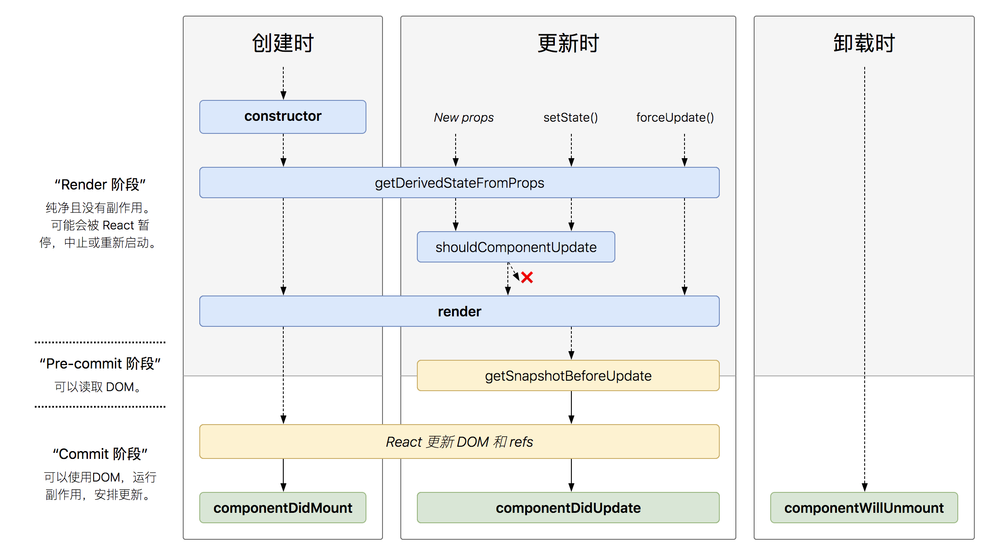

核心内容
* 一个概念 组件
* 四个核心 Api
* 单向数据流
* 完善的错误提示

组件方式考虑 UI
* props + state = view
* 考虑静态UI
* 思考组件的状态组成
* 考虑组件的交互方式

受控组件与非受控组件
* 受控组件：表单元素状态由使用者维护
* 非受控组件：表单元素状态由DOM自身维护

创建组件原则
* 单一职责原则
* 如果组件变得复杂，应该拆分成小组件，出于拆分复杂度和性能的角度考虑

数据状态管理原则
* 能计算得到的状态就不要单独存储
* 组件尽量无状态，所需数据通过props获取

JSX 本质
* 动态创建组件的语法糖
* 属性中使用表达式
* 延展属性
* 表达式作为子元素
* 约定：自定义组件以大写字母开头

生命周期
* 具体图：http://projects.wojtekmaj.pl/react-lifecycle-methods-diagram/
* 三个阶段
  * render 阶段
  * Pre-commit 阶段：可以读取 DOM
  * commit 阶段：可以使用 DOM，运行副作用
* 三个时刻
  * 创建时
  * 更新时（new props、setState、forceUpdate）
  * 卸载时
* constructor
  * 用于初始化内部状态
  * 唯一可以直接修改 state 的地方
  * 避免在构造函数中引入任何副作用或订阅。对于这些用例，请 componentDidMount() 改为使用。
  * 构造函数是初始化状态的正确位置。构造函数也经常用于将事件处理程序绑定到类实例。
  * 如果您没有初始化状态并且没有绑定方法，则不需要为您的 React 组件实现构造函数。
* getDerivedStateFromProps（取代 componentsWillReceiveProps）
  * 当 state 需要从 props 初始化时使用
  * 尽量不要使用：维护两者状态一致性会增加复杂度
  * 每次 render 都会调用
  * 典型场景：表单控件获取默认值
* componentWillMount()
  * 在安装发生之前立即被调用。它之前被调用 render()
  * 在服务器渲染上调用的唯一生命周期钩子。
* componentDidMount
  * 只执行一次
  * UI 渲染完成后调用，需要 DOM 节点的初始化应该放在这里
  * 此方法是设置任何订阅的好地方。如果你这样做，不要忘记退订 componentWillUnmount()
  * 典型场景：获取外部资源
* componentWillUnmount
  * 组件移除时被调用
  * 典型场景：释放资源在，例如使定时器失效，取消网络请求或清理在其中创建的任何订阅
* getSnapshotBeforeUpdate
  * 页面 render 之前调用，state 已更新
  * 典型场景：获取 render 之前的 DOM 状态，比如保存之前的 DOM 状态（滚动位置等）
* componentDidUpdate
  * 每次 UI 更新时被调用，此方法不用于初始渲染。
  * 在更新组件时，将此用作在 DOM 上操作的机会
  * 典型场景：页面需要根据 props 变化重新获取数据
* shouldComponentUpdate
  * 决定 Virtual DOM 是否要重绘
  * 一般可以由 PureComponent 自动实现
  * 典型场景：性能优化
* componentDidCatch()
  * 在其子组件树中的任何位置捕获 JavaScript 错误，记录这些错误并显示回退 UI，而不是崩溃的组件树。

Virtual DOM 与 key
* 广度优先分层比较
* 算法复杂度 O(n)
* 基于两个假设
  * 组件的 DOM 结构是相对稳定的
  * 类型相同的兄弟节点可以被唯一标识

高阶组件和函数作为子组件
* 高阶组件接受组件作为参数，返回新的组件。实现通用的逻辑被不同组件使用，但本身并不包含任何UI的展现。有点像 Vue 的 mixin
* 函数作为子组件，也可以函数作为 props，此时又叫做 render props。有点像 Vue 的插槽系统

Context API
* 解决组件间通信问题，Redux 和 React-router 重度依赖
* React.createContext(value)
* Provider Consumer

为什么需要打包
* 编译 ES6 语法特性，编译 JSX
* 整个资源，例如图片，less/sass
* 优化代码体积
