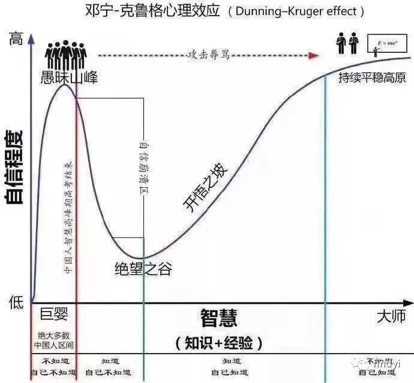

1. 培养透过现象思考本质的能力：多数人只能看到事件本身，在what层面做出反应；少部分人能够总结出事件的规律、模式（how），从而透过表象探寻规律；而只有极少数人能够探求到系统运作背后的结构——理解了系统运作的why，就有可能设计整个系统。
2. 培养复杂系统拆解为简单要素的能力，任何系统都可以进一步拆解为多个「要素」，及要素之间的「连接方式」，在这个定义中，有两个关键词：
  * 要素
  * 连接方式
3. 在工作中付出不亚于任何人的努力
4. 高效且大量的阅读
  * 在勤奋工作的基础上结合工作生活的认知，尽可能高效高质量的大量阅读。并将阅读中的系统化知识点用来整合工作生活中的碎片化知识点，最终形成自己独特的方法论。
  * 阅读首先要选投入产出比高的书籍（高质量且对自己有帮助），这里有个建议：励志鸡汤类的书少看。尽量看经历过时间沉淀的书，尽量看和自己工作生活有关的书籍。
5. 深度思考：在我们工作生活，甚至是学习阅读中，我们会产生很多碎片知识。而只有我们不断进行深度思考，才能真正整合这些碎片知识。只有真正的知识整合之后，我们才会产生认知上的提升。
6. 克服认知障碍，不断突破，认知格局有以下几个阶段：
  * 不知道自己不知道
  * 知道自己不知道
  * 知道自己知道
  * 不知道自己知道
7. 学习身边优秀的人

著名的邓宁-克鲁格效应

> 我们所要极力避免的是让自己不要处于这张图的第一区间。一旦在这个区间，我们可能是一个无知状态，却以为自己无所不知。这种状态下，你的认知是无法提升的。