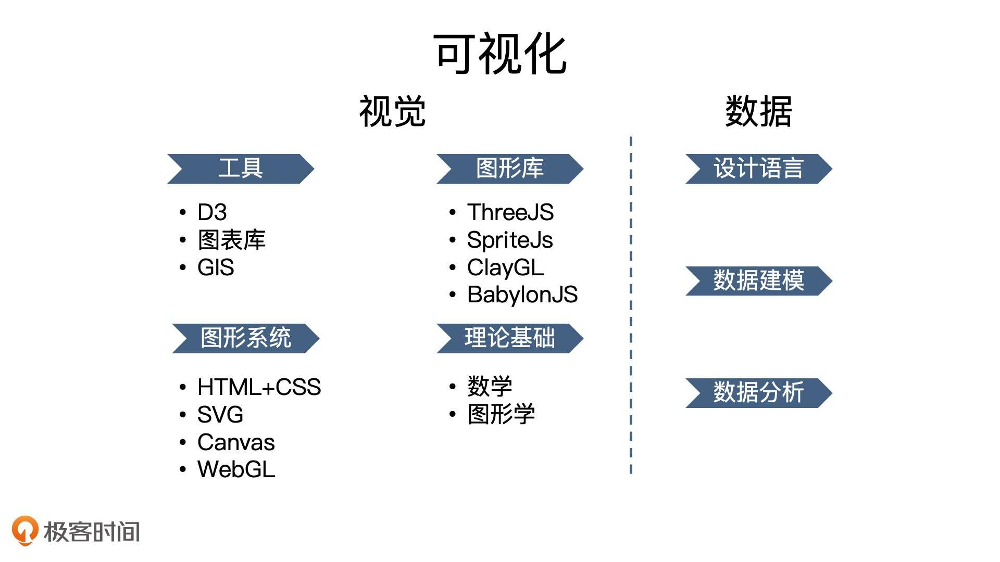

## 为什么
为什么学习可视化呢
* 市场需求
* 能实现许多传统 Web 网页无法实现的效果
* 利用 WebGL 这样的图形系统，更高效的实现更多有趣的图形
* 深入了解图形学和 WebGL 技术，并不局限于可视化领域，游戏、AI 等其他技术领域也有广泛的应用场景
* 丰富知识面，拓宽技术成长裤线

可视化知识结构图

可视化视觉设计主要设计四个部分
1. 理论基础
  * 数学
  * 图形学
2. 图形系统
  * HTML + CSS
  * SVG
  * Canvas
  * WebGL
3. 图形库
  * ThreeJS
  * ……
4. 工具：D3/图表库/GIS

相关资料
* 数学：3blue1brown youtube 视频
* 图形学入门：https://github.com/akira-cn/ICG-WebGL

## 是什么
可视化是将数据组织成易于人所理解和认知的结构，然后用图形的方式形象地呈现出来的理论、方法和技术

Web 开发着重于处理普通的文本和多媒体信息，渲染普通的、易于阅读的文本和多媒体内容，而可视化开发则着重于处理结构化数据，渲染各种相对复杂的图表和图形元素

具体细节区别
1. 样式字节控制上，无法做到如 CSS 那般灵活
2. 处理更多偏视觉方面的细节信息，尤其要精准的呈现大小、距离、角度、高度、光线、阴影等

可视化领域工具
* 图表库：各种类型图表，比如 Echarts、Chartist、Chart.js
* 地理库：专业处理地图、地理位置的可视化，比如 Mapbox、Leaflet、Deck.gl、CesiumJS
* 渲染库：处理视觉呈现，指通用的渲染库（实际上图表库或 GIS 地图库本身底层渲染也基于这些库），比如 ThreeJS、SpriteJS
  * 2D：SpriteJS
  * 3D：ThreeJS、BabylonJS、SpriteJS3D
* 数据驱动框架：处理数据，比如 D3.js，专注于**处理数据的组织形式**
  * 只关注数据的组织形式，将具体的渲染交给底层去做，所以更加灵活，更易扩展
  * 相对的，不像其他的图表库一样，拥有完整的封装，使用门槛也就相对高一些