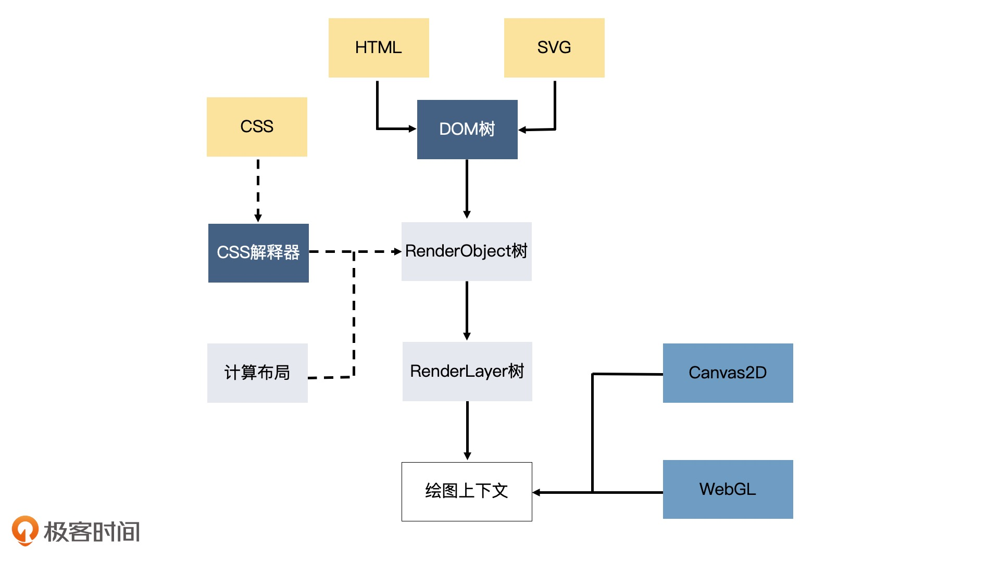
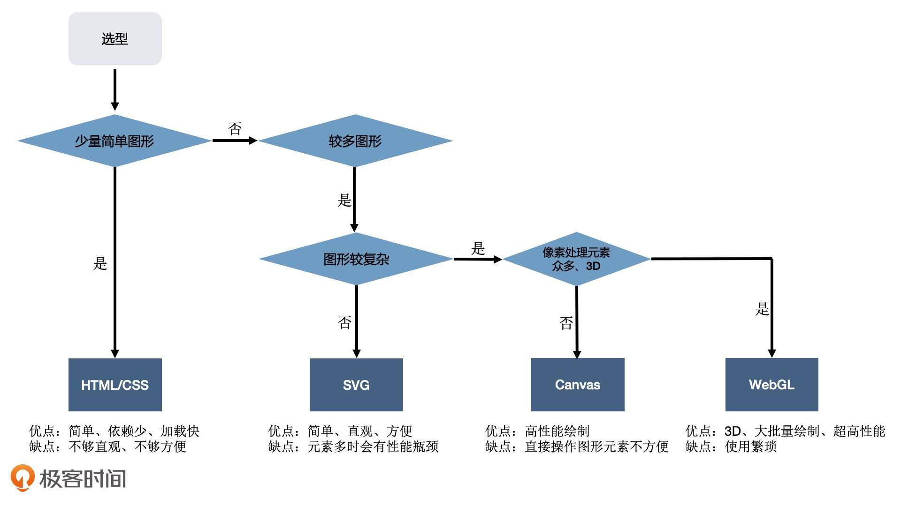

## 实现可视化的四种方式
渲染引擎绘制图形，大体有 4 中方式
1. HTML + CSS
2. SVG：弥补 HTML 在绘制矢量图形方面的能力不足
3. Canvas2D
4. WebGL：通过它，用 GPU 渲染各种复杂的 2D 和 3D 图形。WebGL 利用了 GPU 并行处理的特性，让它在处理大量数据展现的时候，性能大大优于前 3 中绘图方式

### HTML + CSS
HTML + CSS 如何实现可视化，例举几个简单场景
1. 柱状图可以通过网格布局和线性渐变实现
2. 饼图可以使用圆锥渐变
3. 折线图可以通过高度很小的 DIV 模拟线段，用 transform 改变角度和位置

缺点
* 绘制方式不简介，而且 CSS 代码中，很难看出数据与图形的对应关系
* HTML + CSS 作为浏览器渲染引擎的一部分，为了完成渲染工作，除了绘制图形外，还要做很多额外的工作，比如说，浏览器的渲染引擎在工作时，要先解析 HTML、SVG、CSS，构建 DOM 树、Render Object 树和 RenderLayer 树，然后用 HTML 或 SVG 绘图。当图形发生变化时，很可能要重新执行全部的工作，性能开销大。可视化与传统网页不同，不太需要复杂的布局，更多的是在绘图和数据计算，因此这些额外的工作相当于白白消耗了性能

因此 Canvas2D 和 WebGL 更适合去做可视化的绘图工作。他们的绘图 API 能够直接操作绘图上下文，一般不涉及引擎的其他部分，在重绘图形时，也不会发生重新解析文档和构建结构的过程，开销要小的多。

图形系统与浏览器渲染引擎工作对比

### SVG
SVG 全称：Scalable Vector Graphics，可缩放矢量图

SVG 基本知识
* g 标签表示分组
* rect 标签表示矩形元素
* 其他：圆弧、椭圆、多边形和贝塞尔取现等等

> 弥补了 HTML 在不规则图形的绘制上的不足

不足
1. 在渲染引擎中，SVG 元素和 HTML 元素一样，在输出图形前都需要经过引擎的解析、布局计算和渲染树生成
2. 一个 SVG 元素只表示一种基本图形，如果要展示的数据很复杂，生成图形的 SVG 元素就会很多，大量的 SVG 元素不仅会占用很多的内存空间，还会增加引擎、布局计算和渲染树生成的开销，降低性能，减慢渲染速度

### Canvas2D
无论时 HTML/CSS 还是 SVG，他们都属性**声明式**绘图系统，根据数据创建各种不同的图形元素（或者 CSS 规则），然后引擎浏览器渲染引擎解析它们并渲染。

Canvas2D 是浏览器提供的一种可以直接用代码在一块平面的画布上绘制图形的 API，使用它来绘图更像是传统的编写代码，调用绘图指令，然后引擎直接在页面上绘制图形，这是一种**指令式**的绘图系统

为了实现复杂的效果，Canvas2D 还提供了丰富的设置和绘图 API
* 操作上下文，来改变填充和描边颜色
* 对画布进行几何变化
* 调用各种绘图执行
* 将绘制的图形输出到画布上

值得注意的是，HTML/CSS 和 SVG 一个元素对应一个基本图形，所以可以很方便的操作它们，比如注册点击事件。但这样的功能在 Canvas2D 上就比较难实现了。因为对于 Canvas 来说，就是一系列指令的执行过程，无法分别具体哪个元素，因此很难单独对 Canvas 绘图的局部进行控制。**需要通过数学计算，通过定位的方式来获取局部元素**

### WebGL
WebGL 相比前三种方式要复杂很多，API 相对更底层，使用起来也不如前三种简单直接。

通常 Canvas2D 的绘制图形性能已经足够搞了，下面三种情况我们有必要直接操作更强大的 GPU 来实现绘图
* 绘制的图形数量非常多
* 对较大图像的细节做像素处理，比如光影、流体效果和一些复杂的像素滤镜
* 绘制 3D 物体，WebGL 内置了对 3D 物体的投影、深度检测等特性

### 总结
技术方案选择
